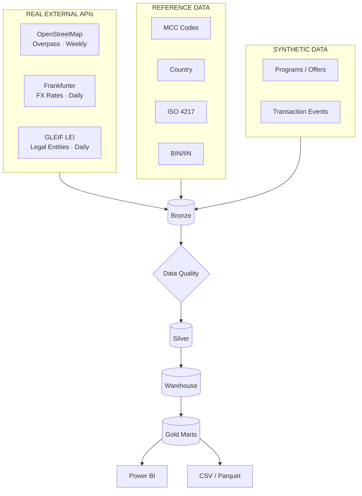

# FinPay Merchant Intelligence & Data Delivery Platform

A production-style Data Engineering platform for ingesting, validating, transforming,
modeling, and delivering fintech and merchant intelligence data.


-blue)


> Badges reflect only what exists in this repository today. Airflow, dbt, Kafka, Power BI,
> and CI badges will be added when those components are actually published here — see
> [23. Project Status](#23-project-status).



Full diagram set: [`architecture/`](architecture/README.md). Full documentation index:
[`docs/`](docs/).

---

## 1. Executive Summary

FinPay ingests real merchant, currency, and institutional data from three independently
verified live public APIs, combines it with real slow-changing reference data and
internally generated synthetic financial events, and is designed to move all of it through
a Bronze → Silver → Gold architecture to two outputs: internal Power BI dashboards and
governed CSV/Parquet files for external stakeholders. This is a Data Engineering project;
Power BI is the last stage of the pipeline, not its purpose.

## 2. Business Problem

Real, individual card-network transaction data is not publicly available anywhere at any
price tier. Issuers, networks, and program owners still need merchant-level and
institutional data for authorization, categorization, rewards eligibility, and
reconciliation. FinPay builds that pipeline honestly: real data where it legitimately
exists, clearly labeled synthetic data where it doesn't. Full detail:
[`docs/02-business-problem.md`](docs/02-business-problem.md).

## 3. Project Vision

A Data Engineering platform first, a fintech-domain project second. See
[`docs/01-project-vision.md`](docs/01-project-vision.md).

## 4. Project Objectives

Real, independently verified API sources · a permanent real/reference/synthetic boundary ·
genuine watermark-driven incremental ingestion · data quality gates that catch real
problems · dual-channel delivery · zero cost. Full list:
[`docs/03-project-objectives.md`](docs/03-project-objectives.md).

## 5. Business Domains

Presented without ranking: **Merchant Intelligence**, **Issuer / Network / Program-Owner
Reporting**, **Rewards / CLO**, **Reconciliation**, **Data Engineering Operations**. Each
domain's contribution: [`docs/05-business-domains.md`](docs/05-business-domains.md).

## 6. Solution Overview

```
REAL EXTERNAL APIs + REFERENCE DATA + SYNTHETIC EVENTS
        ↓
    INGESTION → BRONZE → DATA QUALITY → SILVER → WAREHOUSE → GOLD MARTS
        ↓
    POWER BI  /  CSV / PARQUET DELIVERY
```

## 7. System Architecture

See the diagram above and the full set in [`architecture/`](architecture/README.md).
Narrative: [`docs/08-system-architecture.md`](docs/08-system-architecture.md).

## 8. Live API Sources

| Source | Endpoint | Auth | Frequency | Verification |
|---|---|---|---|---|
| OpenStreetMap Overpass | `POST overpass-api.de/api/interpreter` | None (User-Agent required) | Weekly | VERIFIED live |
| Frankfurter | `GET api.frankfurter.dev/v1/*` | None | Daily | VERIFIED live |
| GLEIF LEI | `GET api.gleif.org/api/v1/lei-records` | None | Daily | VERIFIED live |

Every claim in this table was independently tested against the real production endpoint,
including two real failures encountered and resolved (OSM: missing User-Agent → HTTP 406;
OSM incremental query, too-short timeout → HTTP 504). Full contract per source, exact
fields, and license terms: [`docs/06-data-source-catalog.md`](docs/06-data-source-catalog.md).

## 9. Reference Data

MCC codes, country reference, ISO 4217 currency metadata, and BIN/IIN issuer reference —
real, legitimate data that is slow-changing by the nature of its domain, refreshed at low
frequency, and **never described as a live API**. Full catalog:
[`docs/06-data-source-catalog.md`](docs/06-data-source-catalog.md).

## 10. Synthetic Data

Programs, campaigns, offers, tokenized cardholders, transactions, authorization, clearing,
settlement, reconciliation, and rewards/CLO events are **synthetic** — generated internally
because no legitimate free API provides real transaction-level or proprietary fintech data.

> **Transaction lifecycle and rewards/CLO event data are synthetic because private
> banking/card transaction data is not publicly available through legitimate free APIs.**
> This project does not use real PANs, real cardholders, real transactions, or confidential
> company information, and does not represent synthetic data as real customer data.

## 11. Data Flow

`API/File → fetch → parse → validate → Bronze → Data Quality → Silver → Transformation →
Warehouse → Gold → Delivery`. Full detail: [`docs/09-data-flow.md`](docs/09-data-flow.md).

## 12. Medallion Architecture

Bronze (raw, timestamped, append-only) → Data Quality → Silver (conformed) →
Transformation → Warehouse → Gold Marts. Full detail:
[`docs/10-medallion-architecture.md`](docs/10-medallion-architecture.md).

## 13. Data Warehouse

PostgreSQL, dimensional schema — PLANNED. Conceptual star schema and full field-level
real/reference/synthetic/derived classification:
[`docs/11-data-model.md`](docs/11-data-model.md).

## 14. Data Quality

Ingestion-level structural validation (PLANNED for this repository) plus a planned
cross-source Silver gate. Includes a real example of validation catching a real problem
(a deprecated upstream API correctly flagged rather than silently accepted) — see
[`docs/12-data-quality.md`](docs/12-data-quality.md).

## 15. Incremental Processing

All three live sources have a **verified-live** watermark-driven incremental mechanism —
not real-time, scheduled batch. Full detail, including the two real failures encountered
during verification: [`docs/13-incremental-ingestion.md`](docs/13-incremental-ingestion.md).

## 16. Orchestration

Apache Airflow — PLANNED. Target: one DAG per live source plus a reference-data refresh
DAG, watermarks in Airflow Variables or a dedicated table. Detail:
[`docs/14-orchestration.md`](docs/14-orchestration.md).

## 17. Data Lineage

PLANNED — OpenLineage/Marquez, deferred until Silver/Gold exist to have lineage between.
The metadata foundation for it is designed into every Bronze write from the start. Detail:
[`docs/15-data-lineage.md`](docs/15-data-lineage.md).

## 18. Data Delivery

Two channels: Power BI (internal) and governed CSV/Parquet (issuer, network, program
owner), each with a manifest (control totals, schema version, DQ status). Power BI is the
last stage of this architecture, not its center. Detail:
[`docs/16-data-delivery.md`](docs/16-data-delivery.md).

## 19. Technology Stack

| Category | Technology | Status |
|---|---|---|
| Language | Python, SQL | Core, to be published |
| Database | PostgreSQL | Core |
| APIs | REST / JSON | Core |
| Storage | Parquet | Planned |
| Containers | Docker | Core |
| Orchestration | Apache Airflow | Planned |
| Transformation | Polars / Pandas / DuckDB / dbt | Planned, evaluated per actual need |
| Analytics | Power BI | Planned |
| CI/CD | GitHub Actions | Planned |
| Version control | Git, GitHub | Core |

No technology is added because it "sounds impressive" — each one is expected to have a
real, specific responsibility before it's introduced. See the zero-cost principle in
[`docs/04-project-scope.md`](docs/04-project-scope.md).

## 20. Repository Structure

```
MerchantMCC-DE/
├── README.md
├── LICENSE
├── .gitignore
├── .env.example
├── docs/                  # 01–20, numbered documentation set
├── architecture/
│   ├── README.md          # primary diagrams
│   └── diagrams/          # 8 additional focused diagrams
│
│ (created in later, appropriately scoped phases — not part of this commit)
├── src/ · data/ · sql/ · airflow/ · tests/ · scripts/ · configs/
```

## 21. Testing Strategy

PLANNED for this repository's published code. Design principle already committed to:
every ingestion module separates network I/O from pure parsing logic specifically so tests
never require live network access. Full detail:
[`docs/18-testing-strategy.md`](docs/18-testing-strategy.md).

## 22. Security

`.env` is gitignored; `.env.example` documents variable names only. None of the three live
APIs require a key. `.gitignore` also blocks `*.key`, `*.pem`, and anything matching
`*credentials*`/`*secret*`. Full detail: [`docs/17-security.md`](docs/17-security.md).

## 23. Project Status

**PHASE 0 — PROJECT FOUNDATION**

Completed: GitHub repository created · project identity defined · business domains defined
· live API strategy defined and verified · reference-data strategy defined and verified ·
synthetic-data strategy defined · architecture documented · data model documented ·
repository foundation created.

Not yet implemented: API ingestion · Bronze · Silver · warehouse · Gold · Airflow ·
automation · Power BI · data delivery.

Full status table: [`docs/19-project-status.md`](docs/19-project-status.md).

## 24. Roadmap

Phase 0 (this repository) → Phase 1 (live API implementation) → Phase 2 (Bronze) → Phase 3
(data quality) → Phase 4 (Silver) → Phase 5 (warehouse/Gold) → Phase 6 (Airflow) → Phase 7
(Power BI/delivery). Full table: [`docs/20-roadmap.md`](docs/20-roadmap.md).

## 25. Engineering Outcomes

What this foundation already demonstrates, concretely: independent live verification of
three real APIs (not assumed from documentation alone), a documented source substitution
made mid-project when an assumption about a "free" API stopped being true, a designed
data-quality approach with a real worked example of catching a real problem, and a
permanent, enforced boundary between real, reference, and synthetic data at the
architecture level, before a single ingestion job has been published.

## 26. Data Source Attribution

| Source | License | Attribution |
|---|---|---|
| OpenStreetMap Overpass | ODbL 1.0 | © OpenStreetMap contributors |
| Frankfurter | Open-source project (ECB-sourced data) | — |
| GLEIF LEI | GLEIF open data terms | GLEIF |
| MCC codes (greggles/mcc-codes) | Open, community-compiled | — |
| Country reference (mledoze/countries) | MIT | mledoze/countries contributors |
| ISO 4217 (datasets/currency-codes) | Public Domain (PDDL) | — |
| BIN/IIN (venelinkochev/bin-list-data) | CC BY 4.0 | **Required**: "BIN List Data (venelinkochev/bin-list-data), CC BY 4.0" |

Full catalog: [`docs/06-data-source-catalog.md`](docs/06-data-source-catalog.md).

## 27. Disclaimer

This is a portfolio project. It does not process real payments, does not connect to any
real bank or card network, and does not have access to real cardholder, PAN, or private
banking data. Synthetic data is generated internally and is never represented as real
customer data. All real external data is used under its stated public license — see
[26. Data Source Attribution](#26-data-source-attribution).

---

**Author**: Umair Nawaz — [github.com/mumairnawaz](https://github.com/mumairnawaz)
