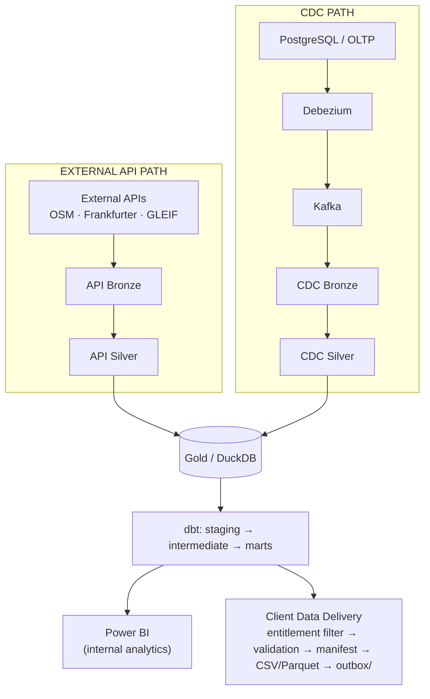

# MerchantMCC-DE — FinPay Merchant Intelligence & Data Delivery Platform

A local, end-to-end Data Engineering platform demonstrating batch and API ingestion,
change-data-capture streaming, dimensional modeling, orchestration, governed data
delivery, and BI consumption over a synthetic fintech/merchant-intelligence domain.


-blue)

> This README describes what is actually implemented and verified in this repository.
> No cloud service, no managed infrastructure, and no production-scale deployment is
> claimed anywhere in this document.


```mermaid
flowchart TB
    subgraph API["EXTERNAL API PATH"]
        EXT["External APIs<br/>OSM · Frankfurter · GLEIF"] --> ABronze["API Bronze"] --> ASilver["API Silver"]
    end
    subgraph CDC["CDC PATH"]
        PG["PostgreSQL / OLTP"] --> DBZ["Debezium"] --> KAFKA["Kafka"] --> CBronze["CDC Bronze"] --> CSilver["CDC Silver"]
    end
    ASilver --> GOLD[("Gold / DuckDB")]
    CSilver --> GOLD
    GOLD --> DBT["dbt: staging → intermediate → marts"]
    DBT --> BI["Power BI<br/>(internal analytics)"]
    DBT --> DELIVERY["Client Data Delivery<br/>entitlement filter → validation → manifest → CSV/Parquet → outbox/"]
```

Full diagram set: [`architecture/`](architecture/README.md). Full documentation index:
[`docs/`](docs/).

---

## 1. Executive Summary

MerchantMCC-DE ingests real merchant, currency, and institutional data from three
independently verified live public APIs, combines it with real slow-changing reference
data and internally generated synthetic financial events, and moves all of it through
two converging pipelines — an API path and a change-data-capture (CDC) path — into a
single dimensional warehouse. From there, dbt produces consumption-ready marts that feed
**two independent downstream consumers**: an internal Power BI semantic model, and a
governed, file-based Client Data Delivery layer. Airflow orchestrates all three
operational pipelines on their own, independently justified schedules.

## 2. Business Purpose

Issuers, networks, and program owners need merchant-level, transaction-level, and
institutional data for authorization, categorization, rewards eligibility, and
reconciliation — but real, individual card-network transaction data is not publicly
available at any price tier. MerchantMCC-DE builds a governed platform around that
constraint honestly: real data where it legitimately exists (merchant, currency, and
legal-entity reference data from live public APIs), clearly labeled synthetic data where
it doesn't (transactions, settlements, rewards).

The platform produces two **distinct** outputs, and they are not the same thing:

1. **Internal analytics** — a Power BI semantic model (PBIP/TMDL) built directly on the
   dbt marts, for interactive exploration by an internal analyst.
2. **External / client data delivery** — governed **CSV/Parquet files with a manifest**
   (schema version, record count, control total, reporting period, validation status),
   filtered by a per-client entitlement configuration, written to a local `outbox/`.
   **Power BI is not the client delivery mechanism** — it is a separate, internal-only
   consumer of the same marts.

## 3. Final Architecture

```
External APIs                         PostgreSQL / OLTP
     |                                       |
API Bronze                              Debezium
     |                                       |
API Silver                                 Kafka
     |                                       |
     |                                  CDC Bronze
     |                                       |
     |                                  CDC Silver
     |                                       |
     +------------------> Gold <-------------+
                            |
                           dbt
                  staging → intermediate → marts
                            |
              +-------------+-------------+
              |                           |
          Power BI                 Client Delivery
        Internal BI              entitlement filter
                                   validation
                                   manifest
                                   CSV/Parquet
                                   outbox/
```

A separate, independent PySpark engineering track exists alongside this (not wired into
Gold — see §6):

```
Spark Bronze → Spark Silver → Spark Gold → Consumption
```

Apache Airflow orchestrates the CDC, API, and Client Delivery pipelines, each on its own
schedule (see §9).

## 4. Data Pipelines — External API Path

```
API → Bronze → Silver → Gold (dimensions)
```

Implemented, live-verified sources:

| Source | Type | Cadence | Mechanism |
|---|---|---|---|
| OpenStreetMap Overpass | Live API | Weekly | Watermark-driven incremental (`newer:` filter) |
| Frankfurter | Live API | Daily | Watermark-driven incremental (date-range endpoint) |
| GLEIF LEI | Live API | Daily | Watermark + pagination |
| MCC reference data | Reference | Ad hoc | Full snapshot replace |
| Country reference data | Reference | Ad hoc | Full snapshot replace |
| ISO 4217 currency data | Reference | Ad hoc | Full snapshot replace |
| BIN/IIN issuer reference data | Reference | Ad hoc | Full snapshot replace |

Each source has real Bronze (raw, timestamped, append-only) and Silver (validated,
conformed) layers, per-source watermark files, and quarantine/rejection handling for
records that fail validation — never silently dropped or silently repaired.

## 5. CDC — PostgreSQL → Debezium → Kafka → Gold

```
PostgreSQL → Debezium → Kafka → CDC Bronze → CDC Silver → Gold
```

This is a real, working, **locally demonstrated** CDC architecture — a single-broker
Kafka instance and a single Debezium connector running in Docker, not a production-scale
multi-broker cluster. It uses genuine PostgreSQL logical replication: Debezium streams
row-level insert/update/delete events into per-table Kafka topics, a Python consumer
persists them into immutable CDC Bronze (append-only, one file per consumer batch), and
CDC Silver applies per-key upsert logic to derive current-state tables while preserving
full history in Bronze. Idempotency is enforced by a checkpoint file per (topic,
partition) tracking the last persisted offset, independent of Kafka's own consumer-group
offset — reprocessing the same messages twice produces zero duplicates. Deletes are
represented as Kafka tombstones and correctly remove rows from CDC Silver's current-state
view without destroying their Bronze history.

## 6. Spark — Independent Engineering Track

```
Spark Bronze → Spark Silver → Spark Gold → Consumption
```

A separate, self-contained PySpark pipeline (`src/spark/`) demonstrating the same
medallion pattern with a distributed-processing engine: a synthetic Bronze generator that
deliberately injects realistic data-quality defects (missing IDs, malformed timestamps,
invalid statuses, duplicate keys), a Bronze→Silver job with validation and rejection
routing, a Silver→Gold job building a small star schema, and a Gold→Consumption job
producing seven reconciled summary marts. **This track is intentionally independent of
the production Gold pipeline** — it shares no code or data with the API/CDC path — and
exists to demonstrate Spark-specific engineering patterns (partitioning, window functions,
ANSI-mode type coercion, three-valued-logic null handling) rather than to reprocess
production volumes that don't require a distributed engine at this scale.

## 7. Gold — Dimensional Model

The convergence point for both source paths: a DuckDB-backed star schema with surrogate
keys, a conformed date dimension, an explicit unknown-member convention (so a fact whose
dimension lookup misses is never silently dropped), API-sourced dimensions
(merchant, MCC, country, currency, card issuer, legal entity), and CDC-sourced facts and
dimensions (transactions, settlements, reconciliation, rewards, clients, programs).

**Live control values** (queried directly from Gold, not hardcoded anywhere in code or
docs):

| Metric | Value |
|---|---|
| `fact_transactions` row count | 4,000 |
| Total transaction amount (all statuses) | £501,672.07 |
| **Approved amount (control total)** | **£435,106.16** |
| Settlement amount | £435,106.16 |
| Reconciliation expected amount | £435,106.16 |
| Reconciliation actual amount | £434,846.91 |
| Reconciliation variance | −£259.25 |

£501,672.07 is the gross total across **all** transaction statuses (approved + declined).
It is **not** the control total. The reconciled identity is specifically:

```
Approved transaction amount  =  Settlement amount  =  Reconciliation expected amount  =  £435,106.16
```

independently recomputed from three separate marts and confirmed equal.

## 8. dbt

```
Gold → dbt staging → dbt intermediate → dbt marts
```

dbt (dbt-core + dbt-duckdb, reading/writing the same `data/gold/gold.duckdb` file) turns
Gold's star schema into six consumption-oriented marts, used identically by **both**
downstream consumers (Power BI and Client Delivery) so that no aggregation logic is
duplicated between them:

- `transaction_mart` · `merchant_mart` · `settlement_mart` · `reconciliation_mart` ·
  `rewards_mart` · `client_program_mart`

A dbt singular test (`assert_control_total_identity.sql`) independently re-verifies the
£435,106.16 identity from the marts themselves on every `dbt build`. dbt documentation has
been generated (`dbt docs generate`) and is present under `dbt/target/`.

## 9. Airflow

Three DAGs, each with an independently justified schedule — the API and Client Delivery
paths deliberately do **not** run on the CDC path's 15-minute cadence, because neither
external API data nor a client-facing extract needs to refresh that often:

| DAG | Schedule | Tasks |
|---|---|---|
| `merchantmcc_cdc_pipeline` | `*/15 * * * *` | `cdc_bronze` → `cdc_silver` → `gold_rebuild` → `dbt_build` |
| `merchantmcc_api_pipeline` | `0 2 * * *` | per-source Bronze/Silver tasks for OpenStreetMap, Frankfurter, GLEIF |
| `merchantmcc_client_delivery` | `0 6 * * *` | `validate_marts` → `generate_client_extracts` → `validate_deliveries` |

All three are plain Airflow-orchestrated calls into the same `src/` entry points used
outside Airflow — no business logic is duplicated inside the DAG files.

## 10. Client Data Delivery

A governed, file-based delivery layer — **the actual external-delivery mechanism**,
distinct from Power BI. Reads dbt marts only (never Bronze/Silver/Gold directly), applies
a per-client entitlement configuration (`configs/client_entitlements.json`) against a
dataset registry (`configs/delivery_datasets.json` — schema version, expected columns,
business grain, output formats, and which datasets require row-level client filtering),
then runs a validation gate before anything is written:

- expected columns present and schema-version-matched
- no unexpected duplicate business-grain keys
- required columns non-null
- a monetary control total reconciled against the source mart (where a meaningful total
  exists — explicitly marked "not applicable" where it doesn't)

Only after every check passes is a **manifest.json** (run ID, client, dataset, schema
version, generation timestamp, reporting period, record count, control total, validation
status) written alongside the requested output format(s) — writes are staged and moved
into place atomically, so a failed validation never leaves a partial or falsely-successful
delivery behind. Re-running the same (client, dataset, reporting period, schema version)
combination is recognized and safely skipped rather than silently overwritten, unless a
new run is explicitly forced.

Implemented datasets: `transaction_mart` (CSV + Parquet) · `settlement_mart` (CSV) ·
`reconciliation_mart` (CSV) · `merchant_mart` (Parquet) · `client_program_mart` (Parquet,
row-filtered per client).

**Current delivery destination is a local `outbox/` directory only.** No SFTP, email,
REST API, S3, or Azure Blob transport exists. Those would be reasonable *future* transport
options layered on top of the existing manifest/validation contract — they are not
implemented today.

## 11. Power BI

A Power BI Project (PBIP) at [`reports/MerchantMCC_S15C_Executive_Overview.pbip`](reports/MerchantMCC_S15C_Executive_Overview.pbip),
authored directly in text form (TMDL semantic model + PBIR report definition) against the
same dbt marts as the Client Delivery layer:

- 5 dbt marts connected via a DuckDB ODBC data source
- 16 DAX measures
- 4 report pages (Executive Overview, Transaction & Merchant Analytics, Settlement &
  Reconciliation, Client / Program Analytics)
- 24 visuals (cards, line/column/donut charts, tables, slicers)
- 46 field references, each verified against the semantic model's real columns/measures

PBIP/PBIR structure and semantic references have been schema-validated, and the ODBC data
connection has been independently validated. **Final Power BI Desktop rendering
verification remains a manual validation step** — this is recorded accurately, not as a
broken feature: no GUI-automation tooling exists in this environment to open Power BI
Desktop and visually confirm rendering.

## 12. Data Quality

Every layer — API Bronze/Silver, CDC Bronze/Silver, Spark, Gold, dbt, Client Delivery —
applies validation before data is trusted downstream, and separates *rejection* from
*silent correction*:

- **Validation & quarantine**: malformed or incomplete records are routed to a quarantine
  output with a recorded failure reason, never silently dropped or silently fixed.
- **Reconciliation**: every layer that produces a monetary total independently
  re-verifies it against its own source rather than trusting a prior layer's number
  (proven concretely by the £435,106.16 identity holding across four separate marts/facts).
- **Duplicate detection**: business-grain uniqueness is explicitly checked, not assumed.
- **Null checks**: required/grain columns are checked for nulls before anything downstream
  consumes them.
- **Idempotency**: CDC checkpoints, API watermarks, dbt's deterministic rebuilds, and
  Client Delivery's manifest-based rerun detection were each verified this way — running
  the same ingestion or delivery twice produces identical results, not duplicates.

## 13. Testing

**760 tests collected.** The most recently observed complete run: **758 passed, 2
transient timeout failures, 3 skipped**. The two timeout failures were traced to a
multi-hour host-suspend event during that specific background run (not a code defect) and
both were confirmed passing when re-run individually afterward. Client Data Delivery has
its own isolated test suite, independently confirmed at **25/25 passing**. This is reported
as the verified evidence available — it is not a claim that every test has passed in one
single, uninterrupted final run of the entire suite.

## 14. Security

- `.env` (the only file holding real local credentials) is gitignored and was never
  committed.
- Airflow's local SimpleAuthManager password file is gitignored and was never committed.
- All credentials are supplied through environment variables / `.env`, read via
  `os.environ`, never hardcoded in source.
- `.env.example` documents variable *names* only.
- None of the three live external APIs require a key.
- A dedicated audit of the repository and git history found no committed secrets.

## 15. Technology Stack

| Technology | Purpose |
|---|---|
| PostgreSQL | OLTP source system |
| Debezium | Change data capture |
| Kafka | CDC event transport |
| Python | Ingestion and pipeline logic |
| PySpark | Independent distributed-transformation track |
| DuckDB | Analytical warehouse |
| dbt | Transformation, testing, consumption marts |
| Airflow | Orchestration |
| Parquet | Analytical/columnar data format |
| CSV | Human-readable client-delivery format |
| Power BI | Internal BI (PBIP/TMDL/PBIR) |
| Docker | Local infrastructure |

## 16. Running the Project

**Prerequisites**: Windows with WSL2 (Ubuntu) and Docker Desktop, Python 3.12+, and
(only if you want to open the Power BI artifact) Power BI Desktop. Paths below are
relative to wherever you clone this repository — replace `<repo-root>` accordingly.

```bash
# 1. Configure environment
cp .env.example .env
# then fill in POSTGRES_*, AIRFLOW_DB_*, AIRFLOW_FERNET_KEY, AIRFLOW_JWT_SECRET
# (generation commands for the last two are documented inline in .env.example)

# 2. Start infrastructure (PostgreSQL, Kafka, Debezium Connect, Airflow)
cd docker
docker compose --env-file ../.env up -d
cd ..

# 3. Python environment
python -m venv .venv
source .venv/bin/activate        # or .venv\Scripts\activate on Windows
pip install requests pyarrow "psycopg[binary]" confluent-kafka duckdb dbt-core dbt-duckdb pytest

# 4. Run tests
python -m pytest -q

# 5. Manual ingestion / delivery entry points
python scripts/run_ingestion.py all              # or a single source name
python scripts/run_delivery.py <client_id> <dataset_name>

# 6. dbt (from the dbt/ directory — profiles.yml resolves paths relative to this cwd)
cd dbt && dbt build --profiles-dir . && cd ..

# 7. Airflow UI
# http://localhost:8081 — merchantmcc_cdc_pipeline, merchantmcc_api_pipeline,
# merchantmcc_client_delivery all run automatically once unpaused
```

## 17. Project Evidence

Screenshots and captured command-line evidence proving the platform actually runs, not
just describing it — organized by area, each with a caption explaining what it proves.
Full gallery: [`docs/assets/screenshots/`](docs/assets/screenshots/).

| Area | What it proves |
|---|---|
| [Airflow](docs/assets/screenshots/airflow/) | 3 DAGs registered/unpaused; a real CDC run with all 4 tasks succeeding |
| [Kafka](docs/assets/screenshots/kafka/) | Real Debezium-generated CDC topics, connector `RUNNING`, zero consumer lag |
| [API ingestion](docs/assets/screenshots/api/) | Real Bronze metadata/watermarks proving live external data enters the platform |
| [PostgreSQL](docs/assets/screenshots/postgres/) | The 11-table synthetic fintech OLTP schema feeding CDC |
| [dbt](docs/assets/screenshots/dbt/) | A real `dbt build` run — 73/73 models and tests passing |
| [Power BI](docs/assets/screenshots/powerbi/) | Honest current status — schema-validated; Desktop rendering not yet confirmed |
| [Client Delivery](docs/assets/screenshots/client-delivery/) | Real `outbox/` structure, a real manifest, entitlement filtering, idempotency |
| [Data Quality](docs/assets/screenshots/data-quality/) | Spark's 1,010 → 875 valid + 135 rejected reconciliation |
| [Testing](docs/assets/screenshots/testing/) | Real test counts and the isolated Client Delivery suite's 25/25 result |

Where a GUI screenshot could not be safely captured automatically (no browser/desktop
automation tooling exists in this environment), the linked directory contains real,
reproducible command-line evidence proving the same fact instead, plus a checklist for
capturing the visual screenshot manually.

## 18. Repository Structure

```
MerchantMCC-DE/
├── src/            # ingestion, silver, gold, cdc, oltp, synthetic, spark, delivery
├── tests/          # mirrors src/ by layer
├── dbt/            # staging → intermediate → marts, tests, DuckDB profile
├── dags/           # the 3 Airflow DAGs
├── docker/         # docker-compose.yml, Airflow image build
├── configs/        # source config, delivery dataset registry, client entitlements
├── data/           # generated Bronze/Silver/Gold/CDC/Spark data (gitignored contents)
├── outbox/         # Client Data Delivery output (gitignored contents)
├── reports/        # the Power BI PBIP project
├── docs/           # numbered design/decision documentation
├── architecture/   # Mermaid diagram set
└── scripts/        # manual CLI entry points (ingestion, delivery)
```

## 19. Project Status

| Area | Status |
|---|---|
| Core Data Engineering Platform | Implemented |
| CDC | Implemented |
| API ingestion | Implemented |
| Spark track | Implemented |
| dbt | Implemented |
| Airflow | Implemented |
| Client Data Delivery | Implemented |
| Power BI PBIP | Schema-validated; Desktop rendering verification pending |
| Documentation | Current |

## 20. What This Project Demonstrates

Concrete, working evidence for: log-based CDC (Debezium/Kafka) alongside batch/API
ingestion; event-stream consumption with checkpointing and idempotency; ETL/ELT across
two converging source paths; data quality, validation, and quarantine at every layer;
dimensional modeling (star schema, surrogate keys, unknown-member handling, SCD
awareness); a distributed-processing (Spark) track alongside a single-node (DuckDB)
warehouse; dbt-based transformation, testing, and documentation; multi-DAG orchestration
with independently justified schedules; reconciliation (an identity independently proven
across four separate marts/facts); governed, entitlement-filtered, manifest-driven data
delivery; and BI consumption via a text-authored (TMDL/PBIR) semantic model.

## 21. Disclaimer

This is a portfolio project. It does not process real payments, does not connect to any
real bank or card network, and does not have access to real cardholder, PAN, or private
banking data. Synthetic data is generated internally and is never represented as real
customer data. All real external data is used under its stated public license.

---

**Author**: Umair Nawaz — [github.com/mumairnawaz](https://github.com/mumairnawaz)
