# MerchantMCC-DE

A local, end-to-end Data Engineering platform for fintech/merchant intelligence —
OLTP → CDC streaming → API ingestion → medallion architecture → dimensional warehouse →
dbt → orchestration → governed client delivery → BI, all real, all locally verified.


-blue)

> This README describes what is actually implemented and verified in this repository. No
> cloud service, no managed infrastructure, and no production-scale deployment is claimed
> anywhere in this document. Full evidence: [`docs/EVIDENCE.md`](docs/EVIDENCE.md).

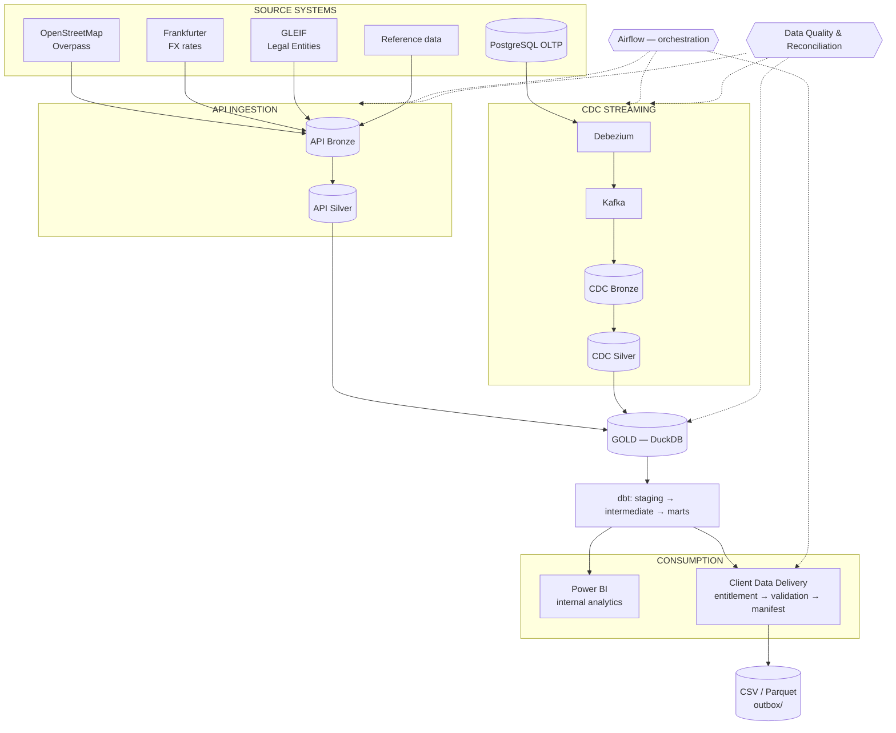
```mermaid
flowchart TB
    subgraph SOURCES["SOURCE SYSTEMS"]
        OSM["OpenStreetMap<br/>Overpass"]
        FX["Frankfurter<br/>FX rates"]
        GLEIF["GLEIF<br/>Legal Entities"]
        REF["Reference data"]
        PG[("PostgreSQL OLTP")]
    end
    subgraph APIPATH["API INGESTION"]
        ABronze[("API Bronze")] --> ASilver[("API Silver")]
    end
    subgraph CDCPATH["CDC STREAMING"]
        DBZ["Debezium"] --> KAFKA["Kafka"] --> CBronze[("CDC Bronze")] --> CSilver[("CDC Silver")]
    end
    OSM --> ABronze
    FX --> ABronze
    GLEIF --> ABronze
    REF --> ABronze
    PG --> DBZ
    ASilver --> GOLD[("GOLD — DuckDB")]
    CSilver --> GOLD
    GOLD --> DBT["dbt: staging → intermediate → marts"]
    subgraph CONSUMPTION["CONSUMPTION"]
        BI["Power BI<br/>internal analytics"]
        DELIVERY["Client Data Delivery<br/>entitlement → validation → manifest"]
    end
    DBT --> BI
    DBT --> DELIVERY
    DELIVERY --> FILES[("CSV / Parquet<br/>outbox/")]
    ORCH{{"Airflow — orchestration"}}
    ORCH -.-> APIPATH
    ORCH -.-> CDCPATH
    ORCH -.-> DELIVERY
    QUALITY{{"Data Quality & Reconciliation"}}
    QUALITY -.-> APIPATH
    QUALITY -.-> CDCPATH
    QUALITY -.-> GOLD
```

Full diagram set (18 diagrams + 5 use-case diagrams): [`architecture/`](architecture/README.md).
Full documentation index: [`docs/`](docs/). Engineering evidence index:
[`docs/EVIDENCE.md`](docs/EVIDENCE.md).

---

## 1. Project Overview

MerchantMCC-DE ingests real merchant, currency, and institutional data from three
independently verified live public APIs, combines it with real slow-changing reference
data and internally generated synthetic financial events, and moves all of it through two
converging pipelines — an API path and a change-data-capture (CDC) path — into a single
dimensional warehouse. dbt produces consumption-ready marts that feed **two independent
downstream consumers**: an internal Power BI semantic model, and a governed, file-based
Client Data Delivery layer. Apache Airflow orchestrates all three operational pipelines
on their own, independently justified schedules.

This is **not** "CSV → Power BI." It is OLTP, log-based CDC streaming, API ingestion,
a medallion (Bronze/Silver/Gold) architecture on both source paths, a distributed-
processing (Spark) track, dimensional modeling, dbt transformation and testing,
multi-DAG orchestration, governed entitlement-filtered data delivery, and BI consumption
— each with real code, real tests, and real evidence, not just described.

## 2. Why MerchantMCC-DE

Real, individual card-network transaction data is not publicly available anywhere, at any
price tier, for legitimate free use. A portfolio project in this domain has to choose
between fabricating a "real-looking" API that doesn't exist, or building honestly on real
reference/institutional data plus clearly labeled synthetic transaction events.
MerchantMCC-DE takes the second path, and treats getting that distinction right as itself
part of the engineering problem — see [3. Business Problems](#3-business-problems).

## 3. Business Problems

Issuers, networks, and program owners need merchant-level, transaction-level, and
institutional data for authorization, categorization, rewards eligibility, and
reconciliation. MerchantMCC-DE's architecture is designed around three concrete
constraints:

1. **No real transaction data exists to use** → synthetic financial events, generated
   internally, never represented as real customer data (`src/synthetic/`).
2. **Merchant/institutional context should be real where it legitimately can be** → three
   live, independently verified, keyless public APIs (OpenStreetMap Overpass, Frankfurter,
   GLEIF) plus real slow-changing reference data (MCC, country, ISO 4217, BIN/IIN).
3. **A dashboard is not a deliverable a downstream system can load and validate** → a
   separate, governed CSV/Parquet delivery layer with a manifest (control totals, schema
   version, validation status) exists specifically because an issuer/network/program
   owner needs a file, not a screen.

## 4. Architecture

The diagram at the top of this README is the canonical picture: two independent source
paths (external APIs, and CDC from the synthetic OLTP system) converge at Gold, from
which dbt produces marts consumed by two independent downstream outputs — Power BI and
Client Data Delivery.

Two things are drawn deliberately as layers **around** the pipeline rather than as
pipeline stages:

- **Airflow (orchestration)** schedules the API, CDC, and Client Delivery pipelines, each
  independently, on three different schedules — it does not sit "in" the data path, it
  triggers the code that does (see [12. Airflow](#12-airflow)).
- **Data Quality & Reconciliation** applies at every stage — API ingestion, CDC, Gold, and
  Client Delivery each validate and reconcile their own output independently, rather than
  relying on one final check at the end (see [13. Data Quality](#13-data-quality)).

A separate, independent PySpark engineering track exists alongside this — it is not wired
into Gold and shares no code or data with the pipeline above (see
[9. PySpark](#9-pyspark)):

```
Spark Bronze → Spark Silver → Spark Gold → Consumption
```

Full diagram set — 18 diagrams including deployment/infrastructure, security boundary,
CDC event lifecycle, and consolidated data quality flow — plus 5 use-case diagrams:
[`architecture/`](architecture/README.md).

### Key technologies (full matrix in [§18](#18-technology--tool-stack))

Python · PostgreSQL · Debezium · Kafka · PySpark · DuckDB · dbt · Apache Airflow ·
Docker · Parquet · Power BI (PBIP/TMDL/PBIR)

## Source → Implementation → Evidence

Every layer below is traceable from its real-world input to the code that processes it to
the proof that it runs. Every path is a real, current path in this repository.

| Layer | Source / Input | Technology | Repository Implementation | Output | Evidence |
|---|---|---|---|---|---|
| API ingestion — merchants | OpenStreetMap Overpass | Python/requests | [`src/ingestion/merchant_osm.py`](src/ingestion/merchant_osm.py) → [`src/silver/merchant.py`](src/silver/merchant.py) | API Bronze → API Silver | Implementation present; GUI evidence not captured — [`docs/assets/screenshots/api/`](docs/assets/screenshots/api/) |
| API ingestion — FX rates | Frankfurter | Python/requests | [`src/ingestion/currency.py`](src/ingestion/currency.py) → [`src/silver/fx_rate.py`](src/silver/fx_rate.py) | API Bronze → API Silver | Implementation present; GUI evidence not captured — [`docs/assets/screenshots/api/`](docs/assets/screenshots/api/) |
| API ingestion — legal entities | GLEIF | Python/requests | [`src/ingestion/gleif.py`](src/ingestion/gleif.py) → [`src/silver/legal_entity.py`](src/silver/legal_entity.py) | API Bronze → API Silver | Implementation present; GUI evidence not captured — [`docs/assets/screenshots/api/`](docs/assets/screenshots/api/) |
| Reference data | MCC · country · ISO 4217 · BIN/IIN | Python/requests | [`src/ingestion/mcc.py`](src/ingestion/mcc.py), [`country.py`](src/ingestion/country.py), [`iso_currency.py`](src/ingestion/iso_currency.py), [`card_issuer.py`](src/ingestion/card_issuer.py) | API Bronze → API Silver | Implementation present; GUI evidence not captured — [`docs/assets/screenshots/api/`](docs/assets/screenshots/api/) |
| Incremental ingestion | All 3 live APIs | Python | [`src/ingestion/watermark.py`](src/ingestion/watermark.py) | per-source watermark files | Implementation present; GUI evidence not captured — [`docs/assets/screenshots/api/`](docs/assets/screenshots/api/) |
| OLTP | Synthetic fintech events | PostgreSQL 16 | [`src/oltp/`](src/oltp/), [`src/synthetic/`](src/synthetic/) | 11-table `finpay` schema | Real screenshots — [`docs/assets/screenshots/postgresql/`](docs/assets/screenshots/postgresql/) |
| CDC capture | PostgreSQL row changes | Debezium | `docker/docker-compose.yml` (`connect` service) | Kafka topics (one per table) | Real screenshots — [`docs/assets/screenshots/kafka/`](docs/assets/screenshots/kafka/) |
| CDC transport | Kafka topics | Apache Kafka | `docker/docker-compose.yml` (`kafka` service) | consumed by `src/cdc/consumer.py` | Real screenshots — [`docs/assets/screenshots/kafka/`](docs/assets/screenshots/kafka/) |
| CDC processing | Kafka change events | Python | [`src/cdc/consumer.py`](src/cdc/consumer.py), [`checkpoint.py`](src/cdc/checkpoint.py), [`silver.py`](src/cdc/silver.py) | CDC Bronze → CDC Silver | CLI evidence — [`docs/assets/screenshots/cdc/`](docs/assets/screenshots/cdc/) |
| Gold warehouse | API Silver + CDC Silver | Python + DuckDB | [`src/gold/dimensions.py`](src/gold/dimensions.py), [`facts.py`](src/gold/facts.py), [`keys.py`](src/gold/keys.py), [`reconciliation.py`](src/gold/reconciliation.py) | `data/gold/gold.duckdb` — 25 facts/dimensions | CLI evidence — [`docs/assets/screenshots/duckdb/`](docs/assets/screenshots/duckdb/) |
| Transformation | Gold | dbt-core + dbt-duckdb | [`dbt/models/staging/`](dbt/models/staging/), [`intermediate/`](dbt/models/intermediate/), [`marts/`](dbt/models/marts/) | 6 analytical marts, 73/73 tests | Real screenshots — [`docs/assets/screenshots/dbt/`](docs/assets/screenshots/dbt/) |
| Orchestration | All 3 operational pipelines | Apache Airflow 3.3.1 | [`dags/merchantmcc_api_pipeline.py`](dags/merchantmcc_api_pipeline.py), [`_cdc_pipeline.py`](dags/merchantmcc_cdc_pipeline.py), [`_client_delivery.py`](dags/merchantmcc_client_delivery.py) | scheduled DAG runs | Real screenshots — [`docs/assets/screenshots/airflow/`](docs/assets/screenshots/airflow/) |
| Analytics | dbt marts | Power BI (PBIP/TMDL/PBIR) | [`reports/MerchantMCC_S15C_Executive_Overview.pbip`](reports/MerchantMCC_S15C_Executive_Overview.pbip) | semantic model + 4-page report | Illustrative mockups only — Desktop rendering not verified — [`docs/assets/screenshots/powerbi/`](docs/assets/screenshots/powerbi/) |
| Client delivery | dbt marts | Python | [`src/delivery/pipeline.py`](src/delivery/pipeline.py), [`config.py`](src/delivery/config.py) | `outbox/<client_id>/<dataset>/<run_id>/` | CLI evidence — [`docs/assets/screenshots/client-delivery/`](docs/assets/screenshots/client-delivery/) |
| Spark track (independent) | Synthetic Bronze | PySpark 4.2 | [`src/spark/bronze_to_silver.py`](src/spark/bronze_to_silver.py), [`silver_to_gold.py`](src/spark/silver_to_gold.py), [`gold_to_consumption.py`](src/spark/gold_to_consumption.py) | Spark Gold + 7 consumption marts | CLI evidence — [`docs/assets/screenshots/spark/`](docs/assets/screenshots/spark/) |

"Implementation present; GUI evidence not captured" means exactly that — the code runs
and is tested, but no GUI screenshot exists for that specific row. It is never used as a
substitute for "implemented."

## Engineering Evidence

This repository includes GUI and execution evidence for the major components of the
platform. The screenshots below are real repository evidence; illustrative assets are
explicitly labeled where applicable. A screenshot demonstrates that a specific fact was
true when it was captured — it is evidence for the row it's attached to, not a substitute
for the code, which is linked separately under **Implementation** in every subsection.

### PostgreSQL — OLTP Source System

PostgreSQL acts as the synthetic FinPay OLTP/source system, holding the transaction and
related fintech entities that feed CDC.

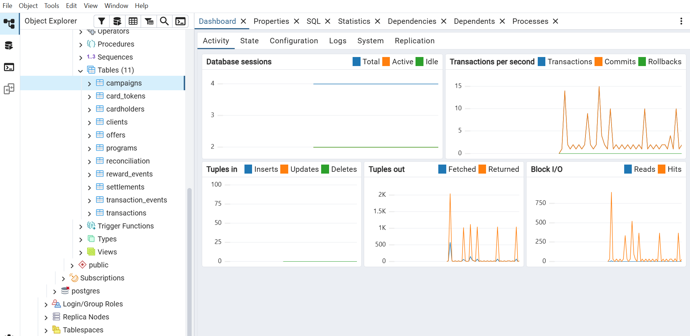

**What this proves:**
- the PostgreSQL source system is running and accessible via a real client (pgAdmin 4)
- the `finpay` schema and its 11 tables exist with real, queryable data
- the project uses PostgreSQL as the OLTP source, not a mocked/stubbed database

**Implementation:** [`src/oltp/`](src/oltp/)

<details>
<summary>View additional PostgreSQL evidence</summary>

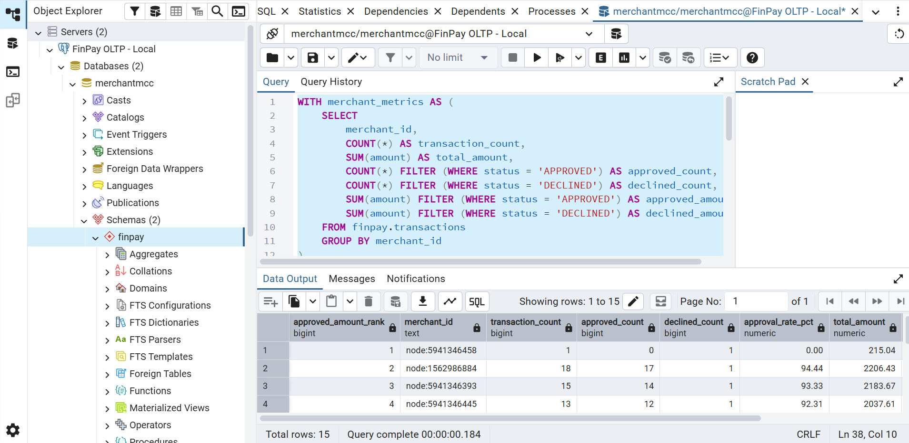

A real ad hoc SQL query against `finpay.transactions`, run directly in pgAdmin's Query
Tool — merchant-level transaction counts and approved/declined amounts.

</details>

### Kafka — CDC Event Transport

Kafka is the CDC transport layer: Debezium publishes every PostgreSQL row change as an
event on a per-table topic, which downstream CDC processing consumes.

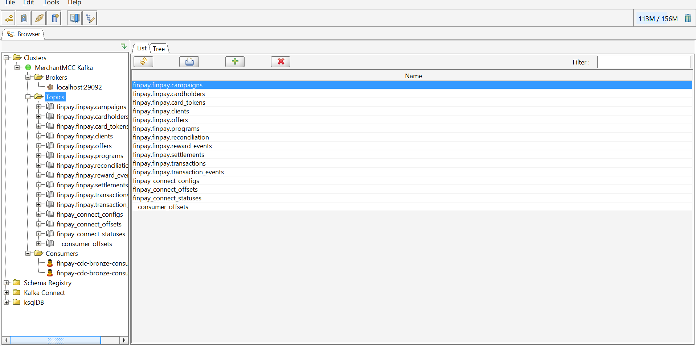

**What this proves:**
- Kafka is running and reachable, with one real topic per source table
- the `finpay.finpay.*` topics are Debezium-generated CDC event streams, not manually
  created topics
- two live consumer instances (`finpay-cdc-bronze-consumer`) are attached and reading

**Implementation:** [`src/cdc/consumer.py`](src/cdc/consumer.py), CDC connector
configuration in [`docker/docker-compose.yml`](docker/docker-compose.yml)

<details>
<summary>View additional Kafka evidence</summary>

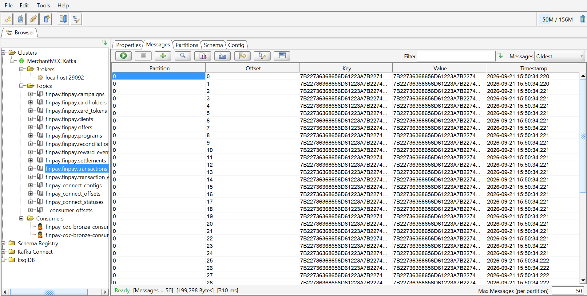

50 real Debezium change-event messages on the `finpay.finpay.transactions` topic, with
real offsets and timestamps — proof that row-level changes are actually reaching Kafka,
not just that the topic exists.

</details>

### Debezium — Change Data Capture

PostgreSQL changes are captured through Debezium and published into Kafka before
downstream CDC Bronze/Silver processing.

**Implementation verified; GUI screenshot not currently captured.** The Kafka topic
browser above (a Kafka GUI, not a Debezium-specific one) shows the topics Debezium
creates and populates, but no screenshot of Debezium's own connector-status page exists in
this repository. The connector's `RUNNING` state is instead documented as real CLI
evidence: [`docs/assets/screenshots/cdc/`](docs/assets/screenshots/cdc/).

**Implementation:** connector configuration in [`docker/docker-compose.yml`](docker/docker-compose.yml),
consumer/checkpoint logic in [`src/cdc/`](src/cdc/)

### Apache Airflow — Pipeline Orchestration

Airflow orchestrates the project's scheduled CDC, API ingestion, and client delivery
workflows, each on its own independently justified schedule.

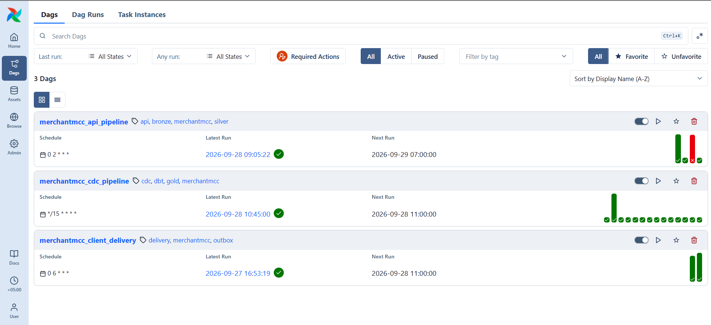

**What this proves:**
- all 3 DAGs (`merchantmcc_api_pipeline`, `merchantmcc_cdc_pipeline`,
  `merchantmcc_client_delivery`) are registered and unpaused
- their real schedules — `0 2 * * *`, `*/15 * * * *`, `0 6 * * *` — as configured in the
  DAG files, not just as documented here
- the most recent runs completed successfully

**Implementation:** [`dags/merchantmcc_cdc_pipeline.py`](dags/merchantmcc_cdc_pipeline.py),
[`merchantmcc_api_pipeline.py`](dags/merchantmcc_api_pipeline.py),
[`merchantmcc_client_delivery.py`](dags/merchantmcc_client_delivery.py)

<details>
<summary>View additional Airflow evidence</summary>

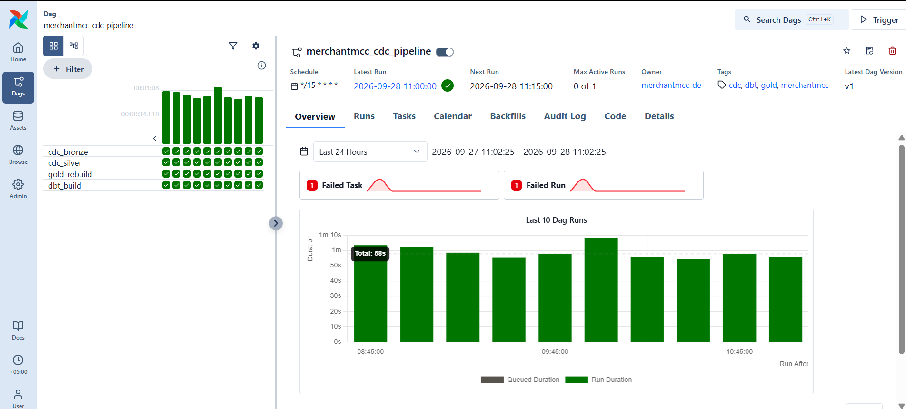

`cdc_bronze → cdc_silver → gold_rebuild → dbt_build`, task grid over the last 24 hours.

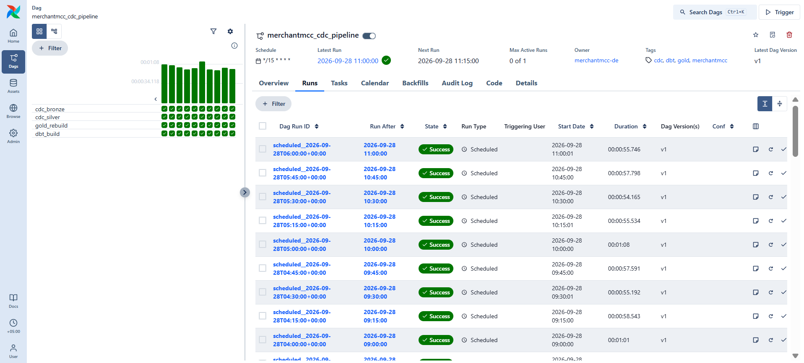

Consecutive scheduled runs on the `*/15 * * * *` cadence, all `Success`.

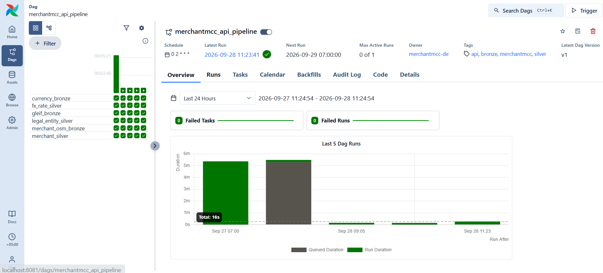

The six per-source Bronze/Silver ingestion tasks, zero failed tasks in the last 24 hours.

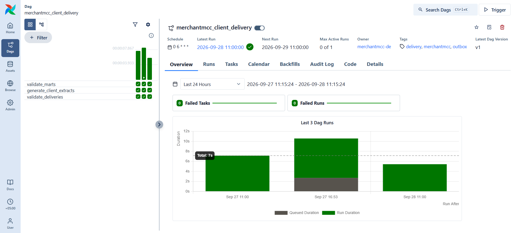

`validate_marts → generate_client_extracts → validate_deliveries`, zero failed tasks.

</details>

### dbt — Transformation & Data Modeling

The dbt layer transforms Gold source relations through staging and intermediate models
into analytical/stakeholder marts, and applies data tests/assertions on every build.


**What this proves:**
- the full, real model DAG: 18 Gold source relations → 18 staging models → 4 intermediate
  enrichment models → 6 marts → the `assert_control_total_identity` test
- the transformation layer is a real, generated dbt docs site, not a description

**Implementation:** [`dbt/models/`](dbt/models/) ·
[`dbt/tests/assert_control_total_identity.sql`](dbt/tests/assert_control_total_identity.sql)

<details>
<summary>View additional dbt evidence</summary>


The generated docs site's detail page for `marts.transaction_mart` — real relation name,
materialization, and column list.

A real `dbt build` run is also captured as CLI evidence, final line:
`Done. PASS=73 WARN=0 ERROR=0 SKIP=0 NO-OP=0 REUSED=0 TOTAL=73` —
[`docs/assets/screenshots/dbt/dbt_build_output.txt`](docs/assets/screenshots/dbt/dbt_build_output.txt).

</details>

### Docker — Local Data Engineering Infrastructure

Docker provides the local infrastructure for PostgreSQL, Kafka, Debezium Connect, and
Airflow — nothing in this platform depends on a cloud service.

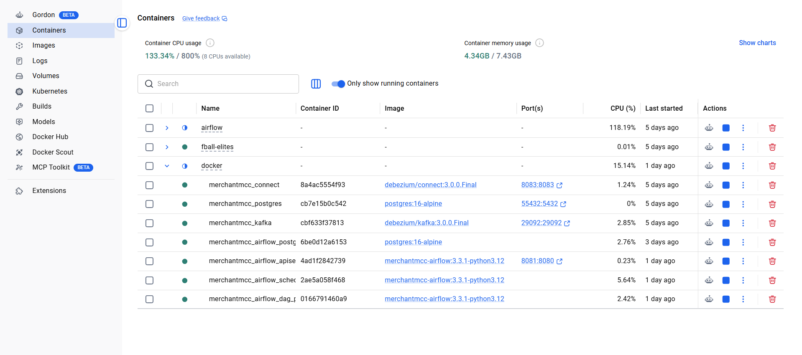

**What this proves:**
- 7 real MerchantMCC containers, all healthy: `merchantmcc_postgres`, `merchantmcc_kafka`,
  `merchantmcc_connect` (Debezium), and 4 Airflow 3 components (including a separate
  metadata-only Postgres instance for Airflow itself)
- the platform actually runs as a set of orchestrated local containers, not a diagram

**Implementation:** [`docker/docker-compose.yml`](docker/docker-compose.yml)

### Power BI — Analytical Consumption

**Illustrative Power BI portfolio mockup — not a verified Power BI Desktop rendering.**

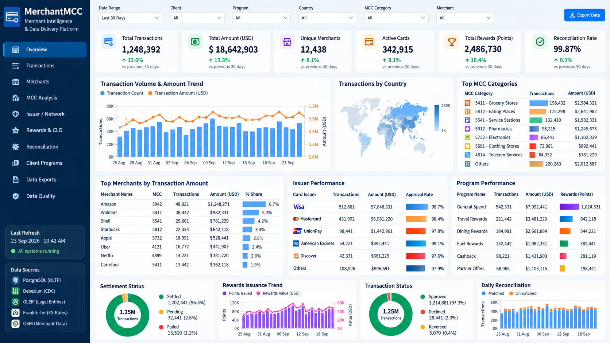

Power BI represents the platform's internal analytical consumption layer, built around
MerchantMCC's Gold/dbt marts:

```
Gold / dbt marts  →  Power BI  →  internal analytics
Gold / dbt marts  →  Client Data Delivery  →  CSV / Parquet  →  client / stakeholder consumption
```

These are two separate channels — Power BI is never the mechanism by which data actually
leaves the platform; Client Data Delivery (below) is.

**What this image is, and is not:** it is a hand-built illustrative mockup showing the
intended dashboard layout and analytical areas. It is **not** a screenshot of Power BI
Desktop, and its on-image figures (e.g. "1,248,392 transactions", "$18,642,903") are
illustrative/synthetic — they do not match this project's real, verified data (4,000
transactions, a £435,106.16 control total). The real PBIP project — 5 dbt marts, 16 DAX
measures, 4 report pages, 24 visuals, schema-validated — exists at
[`reports/MerchantMCC_S15C_Executive_Overview.pbip`](reports/MerchantMCC_S15C_Executive_Overview.pbip),
but its Desktop rendering has not yet been physically confirmed.

**Implementation:** [`reports/MerchantMCC_S15C_Executive_Overview.pbip`](reports/MerchantMCC_S15C_Executive_Overview.pbip) ·
analytical marts in [`dbt/models/marts/`](dbt/models/marts/)

<details>
<summary>View additional Power BI evidence</summary>

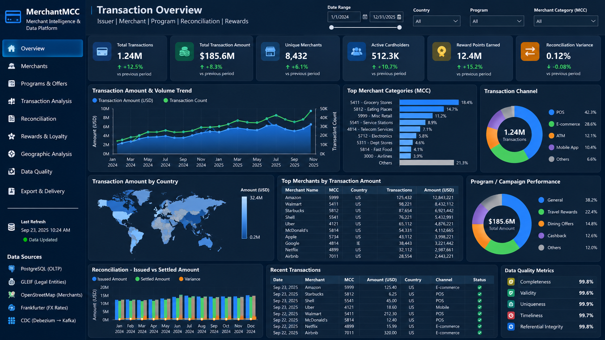

A second illustrative mockup — same caveats as above. A separate mockup built from this
project's real mart/measure names and real control totals (rather than illustrative
figures) is available at [`docs/assets/screenshots/powerbi/ILLUSTRATIVE-MOCKUP.md`](docs/assets/screenshots/powerbi/ILLUSTRATIVE-MOCKUP.md).

</details>

### PySpark — Data Processing Track

An independent PySpark engineering track — its own Bronze → Silver → Gold → Consumption
pipeline, sharing no code or data with the primary Gold warehouse above.

**Implementation verified; execution evidence not currently captured as a screenshot.**
The real, reproducible run numbers (1,010 Bronze records → 875 valid + 135 rejected,
fully reconciled) are documented as CLI evidence:
[`docs/assets/screenshots/spark/`](docs/assets/screenshots/spark/).

**Implementation:** [`src/spark/bronze_to_silver.py`](src/spark/bronze_to_silver.py),
[`silver_to_gold.py`](src/spark/silver_to_gold.py),
[`gold_to_consumption.py`](src/spark/gold_to_consumption.py)

### Client Data Delivery

A governed, file-based delivery layer: per-client entitlements, dataset validation,
control-total reconciliation, and a manifest, before anything is written to the outbox.

**Implementation verified; GUI screenshot not applicable (file-based output, not a GUI
tool).** The real `outbox/` structure and a real manifest are documented as CLI evidence:
[`docs/assets/screenshots/client-delivery/`](docs/assets/screenshots/client-delivery/).

**Implementation:** [`src/delivery/pipeline.py`](src/delivery/pipeline.py) ·
[`configs/delivery_datasets.json`](configs/delivery_datasets.json) ·
[`configs/client_entitlements.json`](configs/client_entitlements.json)

### Data Quality & Testing

Reconciliation, control totals, idempotency, schema validation, and automated tests run
at every layer of the platform, not just at the end.

**Implementation verified; GUI screenshot not applicable (these are CLI/test-runner
outputs, not a GUI tool).** The £435,106.16 control-total identity, independently
re-proven at 3 separate layers, and the real test-suite counts (760 collected; the
isolated Client Delivery suite at 25/25) are documented as CLI evidence:
[`docs/assets/screenshots/data-quality/`](docs/assets/screenshots/data-quality/) ·
[`docs/assets/screenshots/testing/`](docs/assets/screenshots/testing/).

**Implementation:** [`src/gold/reconciliation.py`](src/gold/reconciliation.py) ·
[`dbt/tests/assert_control_total_identity.sql`](dbt/tests/assert_control_total_identity.sql) ·
[`tests/`](tests/)

## 5. Data Engineering Pipeline

End to end: `Source → ingestion → Bronze → validation → Silver → transformation → Gold →
dbt → marts → consumption`, on both the API path and the CDC path independently, before
converging at Gold. See [`architecture/diagrams/10-end-to-end-data-flow.md`](architecture/diagrams/10-end-to-end-data-flow.md)
for the complete combined picture.

## 6. CDC Architecture

```
PostgreSQL → Debezium → Kafka → CDC Bronze → CDC Silver → Gold
```

A real, **locally demonstrated** CDC architecture — a single-broker Kafka instance and a
single Debezium connector running in Docker, not a production-scale multi-broker cluster.
PostgreSQL's own logical replication feeds Debezium, which emits row-level
insert/update/delete events per table into dedicated Kafka topics. A Python consumer
persists every event into immutable CDC Bronze (append-only), tracked by a checkpoint
file per `(topic, partition)` — independent of Kafka's own consumer-group offset — so
reprocessing the same messages twice produces zero duplicates. CDC Silver applies
per-key upsert logic to derive a current-state view while Bronze retains full history;
deletes arrive as Kafka tombstones and correctly remove rows from the current-state view
without erasing their Bronze lineage. Full INSERT/UPDATE/DELETE sequence, with LSN and
checkpoint detail: [`architecture/diagrams/15-cdc-event-lifecycle.md`](architecture/diagrams/15-cdc-event-lifecycle.md).

**Why CDC, not just polling PostgreSQL?** Log-based CDC captures every intermediate state
change (including deletes) with minimal source-database load, in near-real-time, without
requiring the source schema to carry audit columns — a `SELECT * WHERE updated_at > ...`
poll would miss deletes entirely and add read load proportional to poll frequency.

## 7. API Ingestion

```
API → Bronze → Silver → Gold (dimensions)
```

| Source | Type | Cadence | Mechanism |
|---|---|---|---|
| OpenStreetMap Overpass | Live API | Weekly | Watermark-driven incremental (`newer:` filter) |
| Frankfurter | Live API | Daily | Watermark-driven incremental (date-range endpoint) |
| GLEIF LEI | Live API | Daily | Watermark + pagination |
| MCC / country / ISO 4217 / BIN-IIN reference | Reference | Ad hoc | Full snapshot replace |

Each source has real Bronze (raw, timestamped, append-only) and Silver (validated,
conformed) layers, per-source watermark files, and quarantine/rejection handling for
records that fail validation — never silently dropped or silently repaired.

## 8. Medallion Architecture

**Bronze** — raw, as received, timestamped, append-only, never transformed. **Silver** —
validated, conformed, typed, deduplicated; failures go to quarantine with a recorded
reason, not silently dropped. **Gold** — the dimensional model: surrogate keys, conformed
joins, unknown-member handling, shaped for general-purpose analytical querying rather
than any one report. This pattern is applied **independently on both source paths** (API
Bronze/Silver and CDC Bronze/Silver both feed Gold) and again, separately, inside the
independent Spark track (its own Bronze/Silver/Gold, sharing no code or data with the
production path — see [9. PySpark](#9-pyspark)).

## 9. PySpark

```
Spark Bronze → Spark Silver → Spark Gold → Consumption
```

A separate, self-contained PySpark pipeline (`src/spark/`) demonstrating the same
medallion pattern with a distributed-processing engine: a synthetic Bronze generator that
deliberately injects realistic data-quality defects (missing IDs, malformed timestamps,
invalid statuses, duplicate keys), a Bronze→Silver job with validation and rejection
routing, a Silver→Gold job building a small star schema, and a Gold→Consumption job
producing seven reconciled summary marts. Real, current numbers: **1,010 Bronze records →
875 valid + 135 rejected**, fully reconciled. **This track is intentionally independent of
the production Gold pipeline** — it exists to demonstrate Spark-specific engineering
patterns (partitioning, window functions, ANSI-mode type coercion, three-valued-logic
null handling) rather than to reprocess production volumes that don't require a
distributed engine at this scale.

## 10. Data Warehouse

The convergence point for both source paths: a DuckDB-backed star schema with surrogate
keys, a conformed date dimension, an explicit unknown-member convention (so a fact whose
dimension lookup misses is never silently dropped), API-sourced dimensions (merchant,
MCC, country, currency, card issuer, legal entity), and CDC-sourced facts and dimensions
(transactions, settlements, reconciliation, rewards, clients, programs, campaigns, offers,
cardholders, card tokens). 25 real tables/views. Full dimensional model diagram:
[`architecture/diagrams/04-gold-warehouse.md`](architecture/diagrams/04-gold-warehouse.md).

**Live control values** (queried directly from Gold, not hardcoded anywhere in code or
docs):

| Metric | Value |
|---|---|
| `fact_transactions` row count | 4,000 |
| Total transaction amount (all statuses) | £501,672.07 |
| **Approved amount (control total)** | **£435,106.16** |
| Settlement amount | £435,106.16 |
| Reconciliation expected amount | £435,106.16 |
| Reconciliation actual amount | £434,846.91 |
| Reconciliation variance | −£259.25 |

£501,672.07 is the gross total across **all** transaction statuses (approved + declined).
It is **not** the control total. The reconciled identity is specifically:

```
Approved transaction amount  =  Settlement amount  =  Reconciliation expected amount  =  £435,106.16
```

independently recomputed from three separate marts and confirmed equal.

**Why DuckDB, not Snowflake/Databricks/ClickHouse/Trino?** These were explicitly evaluated
in `docs/27-gold-olap-design.md` and deferred — DuckDB satisfies every stated criterion
(embedded, zero-cost, SQL-standard, fast enough at this data scale, no server process to
run) with none of the operational or cost overhead a client-server warehouse would add for
a local portfolio project. Trino specifically was considered and never implemented —
listed only in "explicitly out of scope" sections across the design docs.

## 11. dbt

```
Gold → dbt staging → dbt intermediate → dbt marts
```

dbt (dbt-core + dbt-duckdb, reading/writing the same `data/gold/gold.duckdb` file) turns
Gold's star schema into six consumption-oriented marts, used identically by **both**
downstream consumers (Power BI and Client Delivery) so no aggregation logic is duplicated
between them: `transaction_mart` · `merchant_mart` · `settlement_mart` ·
`reconciliation_mart` · `rewards_mart` · `client_program_mart`.

A dbt singular test (`assert_control_total_identity.sql`) independently re-verifies the
£435,106.16 identity from the marts themselves on every `dbt build`. Real, current result:
**73/73 models and tests passing**. dbt documentation has been generated (`dbt docs
generate`) and is present under `dbt/target/`. Model DAG:
[`architecture/diagrams/05-dbt-marts.md`](architecture/diagrams/05-dbt-marts.md).

## 12. Airflow

Three DAGs, each with an independently justified schedule — the API and Client Delivery
paths deliberately do **not** run on the CDC path's 15-minute cadence, because neither
external API data nor a client-facing extract needs to refresh that often:

| DAG | Schedule | Tasks |
|---|---|---|
| `merchantmcc_cdc_pipeline` | `*/15 * * * *` | `cdc_bronze` → `cdc_silver` → `gold_rebuild` → `dbt_build` |
| `merchantmcc_api_pipeline` | `0 2 * * *` | per-source Bronze/Silver tasks for OpenStreetMap, Frankfurter, GLEIF |
| `merchantmcc_client_delivery` | `0 6 * * *` | `validate_marts` → `generate_client_extracts` → `validate_deliveries` |

All three are plain Airflow-orchestrated calls into the same `src/` entry points used
outside Airflow — no business logic is duplicated inside the DAG files. The API and
Client Delivery DAGs deliberately don't trigger `gold_rebuild`/`dbt_build` directly —
Gold's own rebuild already reads whatever is currently on disk unconditionally, so
freshly-ingested data is naturally picked up by the CDC DAG's next tick without any
cross-DAG dependency. Full detail: [`architecture/diagrams/06-airflow-orchestration.md`](architecture/diagrams/06-airflow-orchestration.md).

## 13. Data Quality

Every layer — API Bronze/Silver, CDC Bronze/Silver, Spark, Gold, dbt, Client Delivery —
applies validation before data is trusted downstream, and separates *rejection* from
*silent correction*. Consolidated flow diagram with real numbers:
[`architecture/diagrams/18-data-quality-flow.md`](architecture/diagrams/18-data-quality-flow.md).

- **Validation & quarantine**: malformed/incomplete records are routed to a quarantine
  output with a recorded failure reason, never silently dropped or silently fixed.
- **Reconciliation**: every layer that produces a monetary total independently
  re-verifies it against its own source (proven by the £435,106.16 identity holding
  across four separate marts/facts).
- **Duplicate detection**: business-grain uniqueness is explicitly checked, not assumed.
- **Null checks**: required/grain columns are checked before anything downstream consumes
  them.
- **Idempotency**: CDC checkpoints, API watermarks, dbt's deterministic rebuilds, and
  Client Delivery's manifest-based rerun detection were each verified by real reruns
  producing identical results, not duplicates.

## 14. Client Data Delivery

A governed, file-based delivery layer — **the actual external-delivery mechanism**,
distinct from Power BI. Reads dbt marts only, applies a per-client entitlement
configuration (`configs/client_entitlements.json`) against a dataset registry
(`configs/delivery_datasets.json`), then runs a validation gate (expected columns,
schema-version match, no duplicate grain keys, no unexpected nulls, control total
reconciled) before anything is written. Only after every check passes is a
**manifest.json** written alongside the requested CSV/Parquet — writes are staged and
moved into place atomically, so a failed validation never leaves a partial delivery
behind. Reruns of the same (client, dataset, period, schema version) are recognized and
safely skipped, never silently overwritten.

Implemented datasets: `transaction_mart` (CSV + Parquet) · `settlement_mart` (CSV) ·
`reconciliation_mart` (CSV) · `merchant_mart` (Parquet) · `client_program_mart` (Parquet,
row-filtered per client). **Current delivery destination is a local `outbox/` directory
only** — see [19. Current Limitations](#19-current-limitations).

## 15. Power BI

Power BI is the platform's **internal analytical consumption layer** — distinct from
Client Data Delivery (§14), which is the actual external-facing delivery mechanism:

```
Gold / dbt marts  →  Power BI  →  internal analytics / operational insight
Gold / dbt marts  →  Client Data Delivery  →  CSV / Parquet  →  client / stakeholder consumption
```

These two channels are never merged — Power BI is for internal teams exploring the data
interactively; Client Data Delivery is what actually leaves the platform as a file, with
its own entitlements, validation, and manifest.

A Power BI Project (PBIP) exists at [`reports/MerchantMCC_S15C_Executive_Overview.pbip`](reports/MerchantMCC_S15C_Executive_Overview.pbip),
authored directly in text form (TMDL semantic model + PBIR report definition): 5 dbt
marts connected via a DuckDB ODBC data source, 16 DAX measures, 4 report pages, 24
visuals, 46 field references verified against the real semantic model. PBIP/PBIR
structure and semantic references are schema-validated, and the ODBC data connection is
independently validated. **Final Power BI Desktop rendering verification remains a manual
step** — recorded accurately, not as a broken feature.

Illustrative dashboard mockups, the real dbt marts and control totals they're built from,
and the honest rendering-verification status are all shown together in
[Engineering Evidence → Power BI](#engineering-evidence) below.

## 16. Testing

**760 tests collected.** Most recently observed complete run: **758 passed, 2 transient
timeout failures (traced to a host-suspend event, both re-confirmed passing
individually), 3 skipped**. Client Data Delivery has its own isolated suite, independently
confirmed at **25/25 passing**. This is reported as the verified evidence available — not
a claim that every test has passed in one single, uninterrupted final run.

## 17. Security

`.env` and Airflow's local password file are gitignored and were never committed; all
credentials are supplied via environment variables, never hardcoded; `.env.example`
documents variable *names* only; none of the three live APIs require a key; a dedicated
repository and git-history audit found no committed secrets. Boundary diagram:
[`architecture/diagrams/17-security-boundary.md`](architecture/diagrams/17-security-boundary.md).

## 18. Technology / Tool Stack

| Technology | Role | Status | Evidence |
|---|---|---|---|
| Python 3.12 | Ingestion, pipeline, orchestration logic | Implemented | `src/`, 760 tests |
| PostgreSQL 16 | OLTP source system | Implemented | [postgresql/](docs/assets/screenshots/postgresql/) |
| Debezium | Change data capture | Implemented | [cdc/](docs/assets/screenshots/cdc/), [docker/](docs/assets/screenshots/docker/) |
| Apache Kafka | CDC event transport | Implemented | [kafka/](docs/assets/screenshots/kafka/) |
| PySpark 4.2 | Independent distributed-transformation track | Implemented | [spark/](docs/assets/screenshots/spark/) |
| DuckDB | Analytical warehouse | Implemented | [duckdb/](docs/assets/screenshots/duckdb/) |
| dbt-core / dbt-duckdb | Transformation, testing, marts | Implemented | [dbt/](docs/assets/screenshots/dbt/) — 73/73 |
| Apache Airflow 3.3.1 | Orchestration (3 DAGs) | Implemented | [airflow/](docs/assets/screenshots/airflow/) |
| Docker / Docker Compose | Local infrastructure | Implemented | [docker/](docs/assets/screenshots/docker/) |
| Parquet | Analytical delivery format | Implemented | [client-delivery/](docs/assets/screenshots/client-delivery/) |
| CSV | Human-readable delivery format | Implemented | [client-delivery/](docs/assets/screenshots/client-delivery/) |
| Power BI (PBIP/TMDL/PBIR) | Internal BI | Schema-validated; Desktop rendering **verification pending** | [powerbi/](docs/assets/screenshots/powerbi/) |
| OpenStreetMap Overpass / Frankfurter / GLEIF | Live, keyless public APIs | Implemented, verified live | [api/](docs/assets/screenshots/api/) |
| GitHub | Version control / publication | Implemented | this repository |
| Trino | OLAP query engine alternative | **Considered, not implemented** | listed only in "out of scope" design-doc sections |

## 19. Current Limitations

- Power BI Desktop rendering has not been physically confirmed (structure is
  schema-validated and the data connection independently proven; see [§15](#15-power-bi)).
- Client Data Delivery's transport is local `outbox/` only — no SFTP, email, REST API, S3,
  or Azure Blob transport exists today.
- Kafka runs as a single broker with one Debezium connector — a real, working CDC
  mechanism, not a production-scale multi-broker deployment.
- No automated data-lineage tool is wired in — lineage metadata is captured at every
  Bronze write, but there is no OpenLineage/Marquez-style UI ([diagram](architecture/diagrams/14-data-lineage.md)).
- The full 760-test suite's most recent single uninterrupted run had 2 transient failures
  from a host-suspend event, not a code defect (see [§16](#16-testing)).

## 20. Future Extensions

Documented, not implemented, and not claimed as existing: real transport for Client Data
Delivery (SFTP/email/API/cloud), Power BI Service publication, a lineage platform
(OpenLineage/Marquez), and a multi-broker Kafka deployment. A cloud warehouse migration
(Databricks/Azure) was also scoped at the planning-and-local-tooling stage only — no
workspace, cluster, or cloud credentials exist, and it is not part of this platform's
current architecture (see [`docs/29-databricks-integration-plan.md`](docs/29-databricks-integration-plan.md)
for the honest record of what was and wasn't done). None of these are required to
demonstrate the engineering already present in this repository.

## Repository Guide

Where each part of the engineering story actually lives:

```text
MerchantMCC-DE/
│
├── src/
│   ├── ingestion/   API ingestion — OSM, Frankfurter, GLEIF, reference data, watermarks
│   ├── silver/      API Silver — validation, conformance, quarantine
│   ├── oltp/        PostgreSQL OLTP schema, loader, synthetic-data config
│   ├── synthetic/   Synthetic fintech event generation (never real customer data)
│   ├── cdc/         CDC Bronze/Silver — consumer, checkpoint, envelope, silver upsert
│   ├── gold/        Gold layer — dimensions, facts, surrogate keys, reconciliation
│   ├── delivery/    Governed Client Data Delivery — entitlements, validation, manifest
│   └── spark/       Independent PySpark track — Bronze → Silver → Gold → Consumption
│
├── dags/            3 Airflow DAGs (API, CDC, Client Delivery)
├── dbt/             dbt project — models/staging, intermediate, marts; tests
├── configs/         source config, delivery dataset registry, client entitlements
├── tests/           50 test files mirroring src/ by layer — 760 tests total
├── scripts/         manual CLI entry points (run_ingestion.py, run_delivery.py)
├── docker/          docker-compose.yml, Airflow image build
├── reports/         the Power BI PBIP project (TMDL semantic model + PBIR report)
├── architecture/    18 Mermaid diagrams + 5 use-case diagrams
├── docs/            29 numbered design docs, EVIDENCE.md, assets/screenshots/
├── data/            generated Bronze/Silver/Gold/CDC/Spark data (gitignored contents)
└── outbox/          Client Data Delivery output (gitignored contents)
```

Full capability → code → test → evidence mapping (all 15 capabilities, one row each):
[`docs/EVIDENCE.md`](docs/EVIDENCE.md). Architecture diagram index:
[`architecture/README.md`](architecture/README.md). Evidence gallery index:
[`docs/assets/screenshots/README.md`](docs/assets/screenshots/README.md).

## Running the Project

**Prerequisites**: Windows with WSL2 (Ubuntu) and Docker Desktop, Python 3.12+, and
(only if you want to open the Power BI artifact) Power BI Desktop.

```bash
# 1. Configure environment
cp .env.example .env
# then fill in POSTGRES_*, AIRFLOW_DB_*, AIRFLOW_FERNET_KEY, AIRFLOW_JWT_SECRET
# (generation commands for the last two are documented inline in .env.example)

# 2. Start infrastructure (PostgreSQL, Kafka, Debezium Connect, Airflow)
cd docker && docker compose --env-file ../.env up -d && cd ..

# 3. Python environment
python -m venv .venv
source .venv/bin/activate        # or .venv\Scripts\activate on Windows
pip install requests pyarrow "psycopg[binary]" confluent-kafka duckdb dbt-core dbt-duckdb pytest

# 4. Run tests
python -m pytest -q

# 5. Manual ingestion / delivery entry points
python scripts/run_ingestion.py all              # or a single source name
python scripts/run_delivery.py <client_id> <dataset_name>

# 6. dbt (from the dbt/ directory — profiles.yml resolves paths relative to this cwd)
cd dbt && dbt build --profiles-dir . && cd ..

# 7. Airflow UI
# http://localhost:8081 — merchantmcc_cdc_pipeline, merchantmcc_api_pipeline,
# merchantmcc_client_delivery all run automatically once unpaused
```

## Disclaimer

This is a portfolio project. It does not process real payments, does not connect to any
real bank or card network, and does not have access to real cardholder, PAN, or private
banking data. Synthetic data is generated internally and is never represented as real
customer data. All real external data is used under its stated public license.

---

**Author**: Umair Nawaz — [github.com/mumairnawaz](https://github.com/mumairnawaz)
