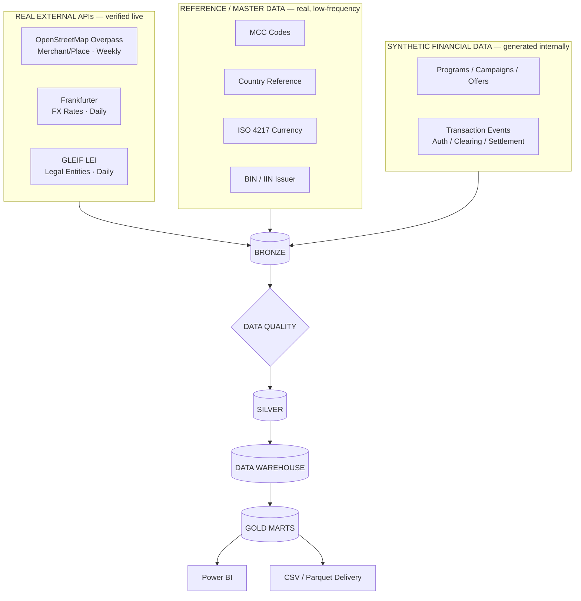
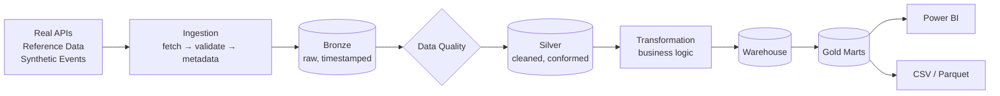

# Architecture

This folder holds every FinPay architecture diagram. The two most important are here; the
rest are in [`diagrams/`](diagrams/), one focused diagram per file. All are Mermaid,
rendered directly by GitHub — no static images, so they stay accurate as the design
evolves.

## 1. High-level platform architecture

## 2. Source → Bronze → Silver → Warehouse → Gold → Delivery

## All diagrams

| # | Diagram | Location |
|---|---|---|
| 1 | High-level platform architecture | above |
| 2 | Source → Bronze → Silver → Warehouse → Gold → Delivery | above |
| 3 | Live API source architecture | [`diagrams/03-live-api-architecture.md`](diagrams/03-live-api-architecture.md) |
| 4 | Real vs Reference vs Synthetic data architecture | [`diagrams/04-real-reference-synthetic.md`](diagrams/04-real-reference-synthetic.md) |
| 5 | Incremental ingestion flow | [`diagrams/05-incremental-ingestion.md`](diagrams/05-incremental-ingestion.md) |
| 6 | Airflow orchestration concept | [`diagrams/06-orchestration-airflow.md`](diagrams/06-orchestration-airflow.md) |
| 7 | Fintech transaction lifecycle | [`diagrams/07-transaction-lifecycle.md`](diagrams/07-transaction-lifecycle.md) |
| 8 | Conceptual warehouse / star schema | [`diagrams/08-star-schema.md`](diagrams/08-star-schema.md) |
| 9 | Data lineage | [`diagrams/09-data-lineage.md`](diagrams/09-data-lineage.md) |
| 10 | Final data delivery architecture | [`diagrams/10-data-delivery.md`](diagrams/10-data-delivery.md) |
