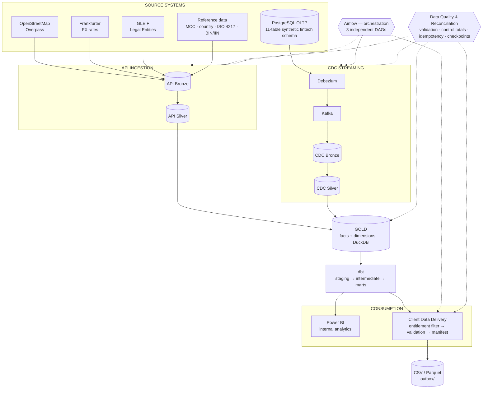

# Architecture

This folder holds every MerchantMCC-DE architecture diagram. The overall picture is here;
each stage has its own focused diagram in [`diagrams/`](diagrams/). All are Mermaid,
rendered directly by GitHub — no static images, so they stay accurate as the
implementation evolves.

## High-level platform architecture

```mermaid
flowchart TB
    subgraph SOURCES["SOURCE SYSTEMS"]
        OSM["OpenStreetMap<br/>Overpass"]
        FX["Frankfurter<br/>FX rates"]
        GLEIF["GLEIF<br/>Legal Entities"]
        REF["Reference data<br/>MCC · country · ISO 4217 · BIN/IIN"]
        PG[("PostgreSQL OLTP<br/>11-table synthetic fintech schema")]
    end
    subgraph APIPATH["API INGESTION"]
        ABronze[("API Bronze")] --> ASilver[("API Silver")]
    end
    subgraph CDCPATH["CDC STREAMING"]
        DBZ["Debezium"] --> KAFKA["Kafka"] --> CBronze[("CDC Bronze")] --> CSilver[("CDC Silver")]
    end
    OSM --> ABronze
    FX --> ABronze
    GLEIF --> ABronze
    REF --> ABronze
    PG --> DBZ
    ASilver --> GOLD[("GOLD<br/>facts + dimensions — DuckDB")]
    CSilver --> GOLD
    GOLD --> DBT["dbt<br/>staging → intermediate → marts"]
    subgraph CONSUMPTION["CONSUMPTION"]
        BI["Power BI<br/>internal analytics"]
        DELIVERY["Client Data Delivery<br/>entitlement filter → validation → manifest"]
    end
    DBT --> BI
    DBT --> DELIVERY
    DELIVERY --> FILES[("CSV / Parquet<br/>outbox/")]
    ORCH{{"Airflow — orchestration<br/>3 independent DAGs"}}
    ORCH -.-> APIPATH
    ORCH -.-> CDCPATH
    ORCH -.-> DELIVERY
    QUALITY{{"Data Quality & Reconciliation<br/>validation · control totals · idempotency · checkpoints"}}
    QUALITY -.-> APIPATH
    QUALITY -.-> CDCPATH
    QUALITY -.-> GOLD
    QUALITY -.-> DELIVERY
```

A separate, independent PySpark track (Bronze → Silver → Gold → Consumption) sits
alongside this — see
[`diagrams/01-overall-architecture.md`](diagrams/01-overall-architecture.md) for the
complete picture including it.

## All diagrams

**Primary sequence** — one diagram per pipeline stage, in data-flow order:

| # | Diagram | Location |
|---|---|---|
| 1 | Overall architecture (both source paths, Airflow, Spark) | [`diagrams/01-overall-architecture.md`](diagrams/01-overall-architecture.md) |
| 2 | API ingestion (OSM, Frankfurter, GLEIF, reference data) | [`diagrams/02-api-ingestion.md`](diagrams/02-api-ingestion.md) |
| 3 | CDC pipeline (PostgreSQL → Debezium → Kafka → CDC Bronze/Silver) | [`diagrams/03-cdc-pipeline.md`](diagrams/03-cdc-pipeline.md) |
| 4 | Gold warehouse (facts, dimensions, live control values) | [`diagrams/04-gold-warehouse.md`](diagrams/04-gold-warehouse.md) |
| 5 | dbt marts (staging → intermediate → marts) | [`diagrams/05-dbt-marts.md`](diagrams/05-dbt-marts.md) |
| 6 | Airflow orchestration (all 3 DAGs, real schedules) | [`diagrams/06-airflow-orchestration.md`](diagrams/06-airflow-orchestration.md) |
| 7 | Client Data Delivery (entitlements, validation, manifest) | [`diagrams/07-client-data-delivery.md`](diagrams/07-client-data-delivery.md) |
| 8 | Power BI consumption (PBIP/TMDL/PBIR) | [`diagrams/08-power-bi-consumption.md`](diagrams/08-power-bi-consumption.md) |
| 9 | Spark pipeline (independent engineering track) | [`diagrams/09-spark-pipeline.md`](diagrams/09-spark-pipeline.md) |
| 10 | End-to-end data flow (everything combined) | [`diagrams/10-end-to-end-data-flow.md`](diagrams/10-end-to-end-data-flow.md) |

**Supplementary diagrams** — domain/design detail referenced from the docs above, not
duplicating them:

| # | Diagram | Location |
|---|---|---|
| 11 | Real vs reference vs synthetic data boundary | [`diagrams/11-real-reference-synthetic.md`](diagrams/11-real-reference-synthetic.md) |
| 12 | Incremental (watermark) ingestion sequence | [`diagrams/12-incremental-ingestion.md`](diagrams/12-incremental-ingestion.md) |
| 13 | Fintech transaction lifecycle (synthetic) | [`diagrams/13-transaction-lifecycle.md`](diagrams/13-transaction-lifecycle.md) |
| 14 | Data lineage (metadata foundation; full lineage tooling remains a documented future extension) | [`diagrams/14-data-lineage.md`](diagrams/14-data-lineage.md) |
| 15 | CDC event lifecycle (INSERT/UPDATE/DELETE, LSN, checkpoint, idempotency) | [`diagrams/15-cdc-event-lifecycle.md`](diagrams/15-cdc-event-lifecycle.md) |
| 16 | Deployment / local infrastructure (real containers, network, mounts) | [`diagrams/16-deployment-infrastructure.md`](diagrams/16-deployment-infrastructure.md) |
| 17 | Security boundary (what's a secret, where it's enforced) | [`diagrams/17-security-boundary.md`](diagrams/17-security-boundary.md) |
| 18 | Data quality flow, consolidated across all 4 pipelines with real numbers | [`diagrams/18-data-quality-flow.md`](diagrams/18-data-quality-flow.md) |

## Use-case diagrams

Who uses this platform and how — see [`use-cases/`](use-cases/).

## Evidence

Real, verified engineering evidence (CLI output, real run results, and an honestly-labeled
Power BI mockup) — see [`docs/assets/screenshots/`](../docs/assets/screenshots/) and
[`docs/EVIDENCE.md`](../docs/EVIDENCE.md).
