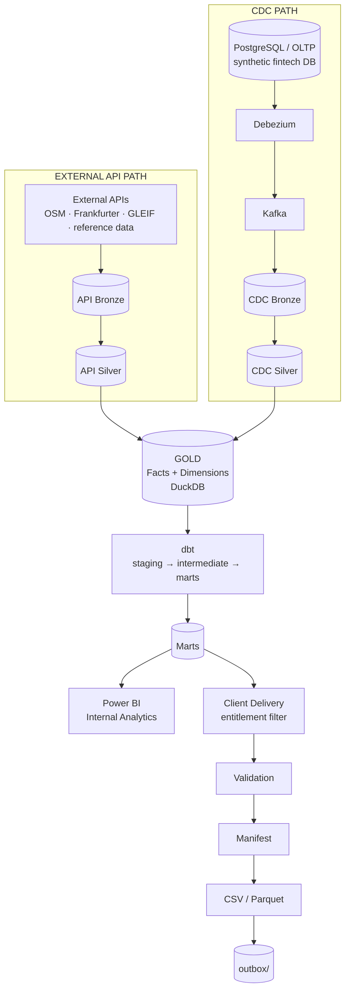
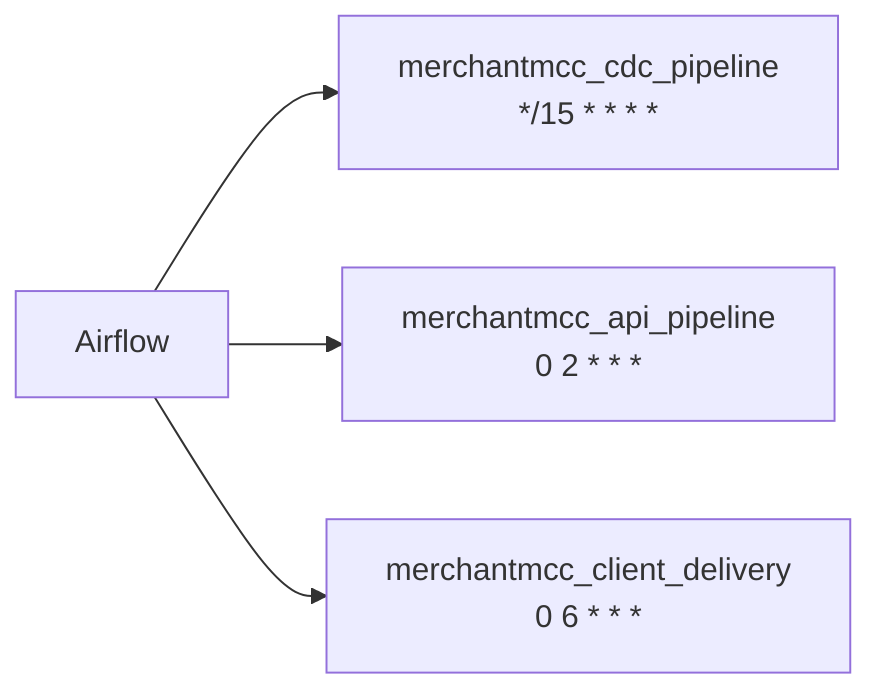
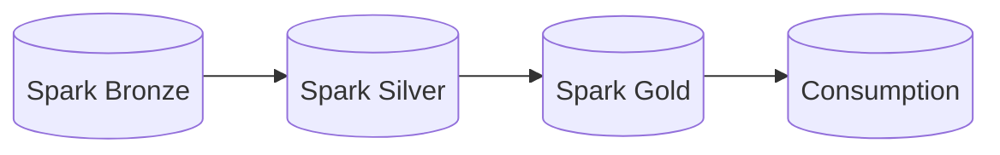

# 1. Overall Architecture

The two source paths (external API, and CDC from the synthetic OLTP system) converge at
Gold, from which dbt produces marts consumed by two independent downstream outputs.

A separate, independent PySpark engineering track exists alongside this architecture — it
shares no code or data with the pipeline above. See
[`09-spark-pipeline.md`](09-spark-pipeline.md).

Each stage of the primary architecture has its own focused diagram in this folder — see
the index in [`architecture/README.md`](../README.md).
