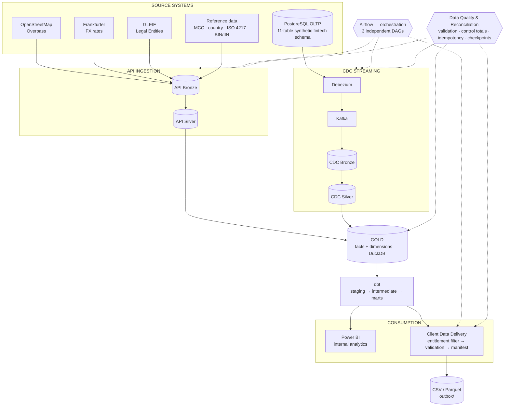
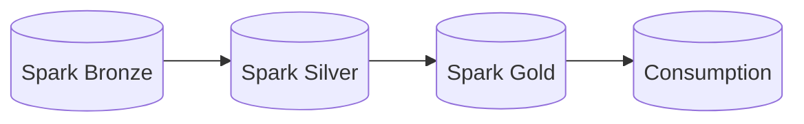

# 1. Overall Architecture

The two source paths (external API, and CDC from the synthetic OLTP system) converge at
Gold, from which dbt produces marts consumed by two independent downstream outputs.

Airflow orchestrates the API, CDC, and Client Delivery pipelines on three independent
schedules (`0 2 * * *`, `*/15 * * * *`, `0 6 * * *` respectively — see
[`06-airflow-orchestration.md`](06-airflow-orchestration.md)); it is drawn here as an
orchestration layer around the pipelines it schedules, not as another pipeline stage.
Data quality and reconciliation controls apply at every stage, not just at the end — see
[`18-data-quality-flow.md`](18-data-quality-flow.md) for the consolidated view with real
numbers.

A separate, independent PySpark engineering track exists alongside this architecture — it
shares no code or data with the pipeline above. See
[`09-spark-pipeline.md`](09-spark-pipeline.md).

Each stage of the primary architecture has its own focused diagram in this folder — see
the index in [`architecture/README.md`](../README.md).
