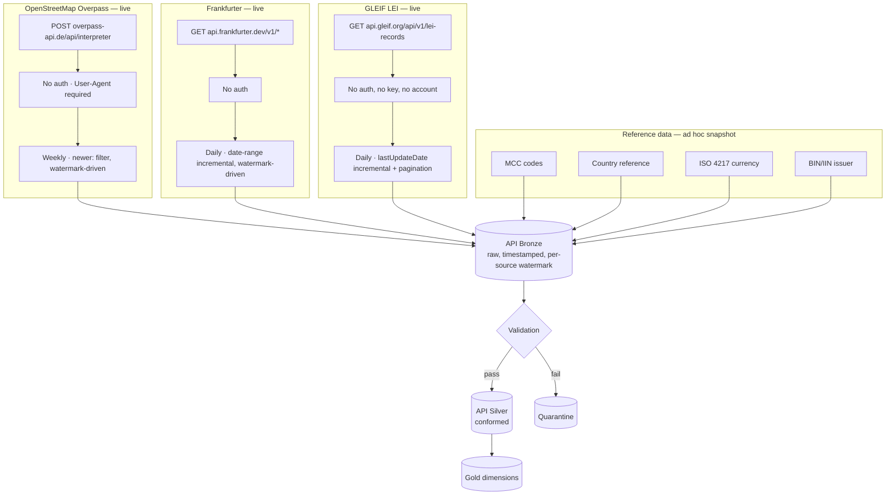

# 2. API Ingestion

All three live sources are independently verified against their real production
endpoints, including two real failures encountered and resolved during development (OSM:
missing `User-Agent` → HTTP 406; OSM's incremental query, too-short timeout → HTTP 504).
Each source has its own persisted watermark file, so a scheduled rerun only requests
new/changed records — never a full reload — and every record that fails validation is
routed to quarantine with a recorded reason, never silently dropped or repaired.

Orchestrated by Airflow's `merchantmcc_api_pipeline` DAG (`0 2 * * *`) — see
[`06-airflow-orchestration.md`](06-airflow-orchestration.md). Full source-by-source
detail: [`docs/06-data-source-catalog.md`](../../docs/06-data-source-catalog.md),
[`docs/13-incremental-ingestion.md`](../../docs/13-incremental-ingestion.md).
