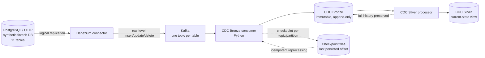

# 3. CDC Pipeline

A real, **locally demonstrated** CDC architecture — a single-broker Kafka instance and one
Debezium connector in Docker, not a production-scale multi-broker cluster. PostgreSQL's
own logical replication feeds Debezium, which emits row-level insert/update/delete events
per table into dedicated Kafka topics. A Python consumer persists every event into
immutable CDC Bronze (append-only; nothing is ever rewritten), tracked by a checkpoint
file per `(topic, partition)` — independent of Kafka's own consumer-group offset — so
reprocessing the same messages twice produces zero duplicates. CDC Silver applies
per-key upsert logic to derive a current-state view while Bronze retains full history;
deletes arrive as Kafka tombstones and correctly remove rows from the current-state view
without erasing their Bronze lineage.

Orchestrated by Airflow's `merchantmcc_cdc_pipeline` DAG (`*/15 * * * *`) — see
[`06-airflow-orchestration.md`](06-airflow-orchestration.md). Full detail:
[`docs/24-postgresql-debezium-kafka-cdc.md`](../../docs/24-postgresql-debezium-kafka-cdc.md),
[`docs/25-cdc-bronze-design.md`](../../docs/25-cdc-bronze-design.md),
[`docs/26-cdc-silver-design.md`](../../docs/26-cdc-silver-design.md).
