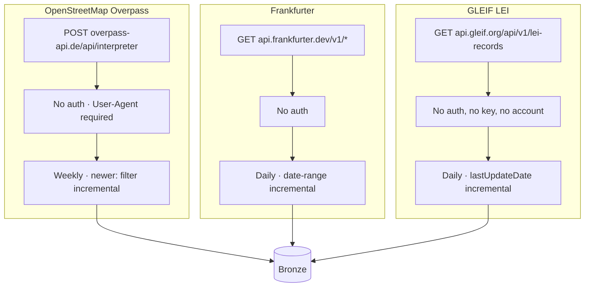

# 3. Live API Source Architecture

All three mechanisms shown here were independently verified against the live production
endpoints, including two real failures encountered and resolved (missing User-Agent on
OSM → HTTP 406; too-short timeout on OSM's incremental filter → HTTP 504). Full detail:
[`docs/13-incremental-ingestion.md`](../../docs/13-incremental-ingestion.md).
