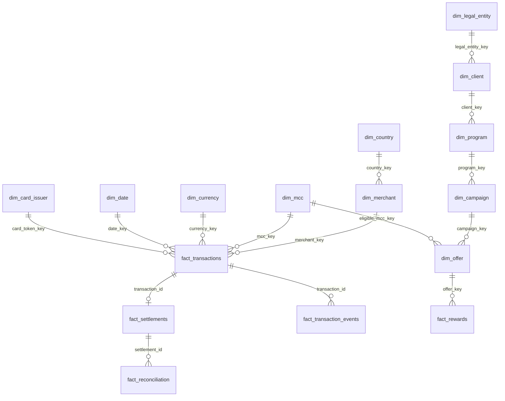

# 4. Gold Warehouse

The convergence point for both source paths — a DuckDB-backed star schema.

- **API-sourced dimensions**: `dim_merchant`, `dim_mcc`, `dim_country`, `dim_currency`,
  `dim_card_issuer`, `dim_legal_entity`.
- **CDC-sourced dimensions/facts**: `dim_client`, `dim_program`, `dim_campaign`,
  `dim_offer`, `dim_cardholder`, `dim_card_token`, `fact_transactions`,
  `fact_transaction_events`, `fact_settlements`, `fact_reconciliation`, `fact_rewards`.
- Deterministic surrogate keys, a conformed `dim_date`, and an explicit **unknown-member**
  convention (surrogate key `-1`) so a fact whose dimension lookup misses is never
  silently dropped.

**Live values, queried directly from Gold** (not hardcoded anywhere in code or docs):

| Metric | Value |
|---|---|
| `fact_transactions` row count | 4,000 |
| Total transaction amount (all statuses) | £501,672.07 |
| Approved amount (control total) | £435,106.16 |
| Settlement amount | £435,106.16 |
| Reconciliation expected amount | £435,106.16 |
| Reconciliation actual amount | £434,846.91 |
| Reconciliation variance | −£259.25 |

Full detail: [`docs/27-gold-olap-design.md`](../../docs/27-gold-olap-design.md).
