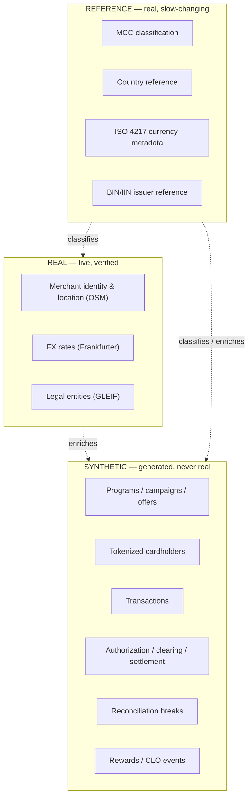

# 4. Real vs Reference vs Synthetic Data Architecture

No synthetic record is ever labeled, formatted, or delivered in a way that implies it is a
real transaction, or that this project has access to real cardholder or private banking
data. This boundary is enforced with a `source_type` field carried from Bronze through to
any delivered output.
