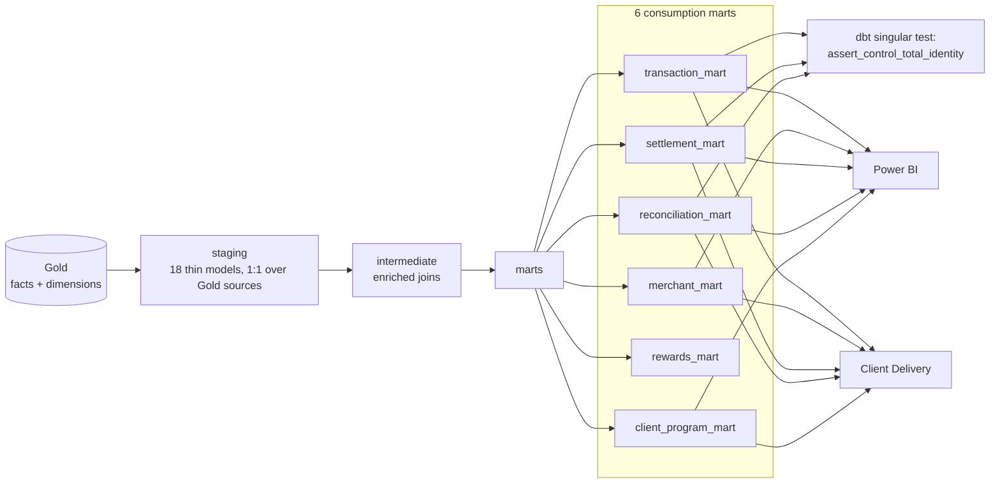

# 5. dbt Marts

dbt (dbt-core + dbt-duckdb, operating on the same `data/gold/gold.duckdb` file Gold
writes) turns the star schema into consumption-oriented marts used **identically by both
downstream consumers** — Power BI and Client Delivery both read the same marts, so no
aggregation logic is duplicated between them. A dbt singular test independently
re-verifies the £435,106.16 control-total identity from the marts themselves on every
`dbt build`. dbt documentation has been generated (`dbt docs generate`) and is present
under `dbt/target/`.

Orchestrated as the final task (`dbt_build`) of Airflow's `merchantmcc_cdc_pipeline` DAG.
Full detail: [`docs/28-dbt-transformation-layer-design.md`](../../docs/28-dbt-transformation-layer-design.md).
