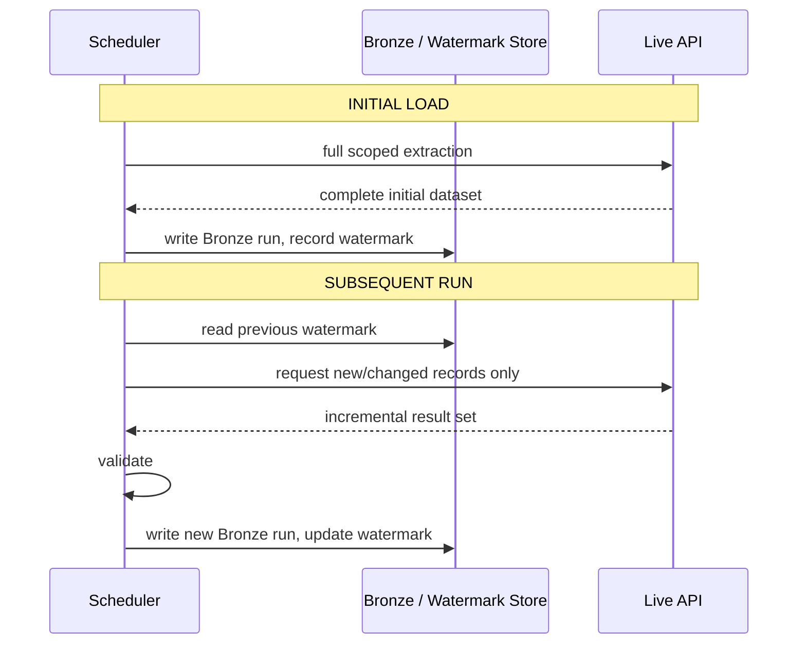

# 5. Incremental Ingestion Flow

Applies identically to all three live sources (OSM, Frankfurter, GLEIF), each with its own
watermark field and query syntax — see [`docs/13-incremental-ingestion.md`](../../docs/13-incremental-ingestion.md)
for the source-specific mechanisms, all independently verified live.
