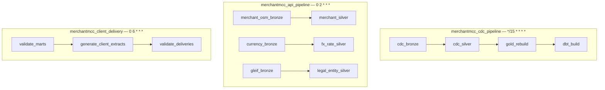

# 6. Airflow Orchestration

Three DAGs, each on an independently justified schedule — the API and Client Delivery
paths deliberately do not run on the CDC path's 15-minute cadence, since neither external
API data nor a client-facing extract needs to refresh that often.

All three DAGs are plain Airflow-orchestrated calls into the same `src/` entry points
used outside Airflow (`scripts/run_ingestion.py`, `scripts/run_delivery.py`, and the
Gold/dbt pipeline functions) — no business logic is duplicated inside the DAG files
themselves. The API and Client Delivery DAGs deliberately do not trigger `gold_rebuild`
or `dbt_build` directly; Gold's own rebuild already reads whatever is currently on disk
unconditionally, so freshly-ingested API data or a freshly-generated client extract is
naturally picked up by the CDC DAG's next scheduled tick (at most 15 minutes later)
without any cross-DAG dependency or duplicated rebuild logic.

Full detail: [`docs/14-orchestration.md`](../../docs/14-orchestration.md).
