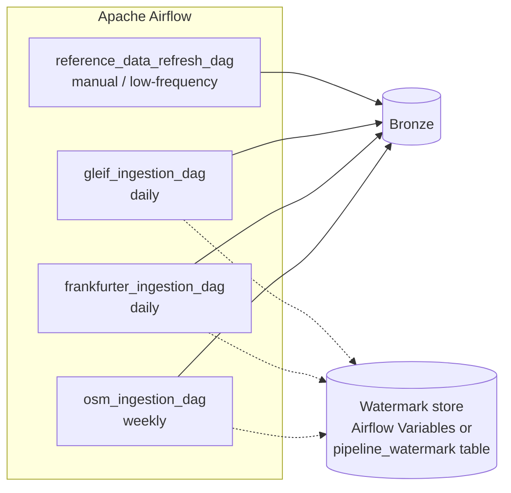

# 6. Airflow Orchestration Concept

Status: PLANNED — no Airflow installation or DAGs exist yet.

```mermaid
flowchart LR
    subgraph Airflow["Apache Airflow"]
        D1["osm_ingestion_dag<br/>weekly"]
        D2["frankfurter_ingestion_dag<br/>daily"]
        D3["gleif_ingestion_dag<br/>daily"]
        D4["reference_data_refresh_dag<br/>manual / low-frequency"]
    end
    D1 --> BRONZE[("Bronze")]
    D2 --> BRONZE
    D3 --> BRONZE
    D4 --> BRONZE
    WM[("Watermark store<br/>Airflow Variables or<br/>pipeline_watermark table")]
    D1 -.-> WM
    D2 -.-> WM
    D3 -.-> WM
```

Full narrative: [`docs/14-orchestration.md`](../../docs/14-orchestration.md).
