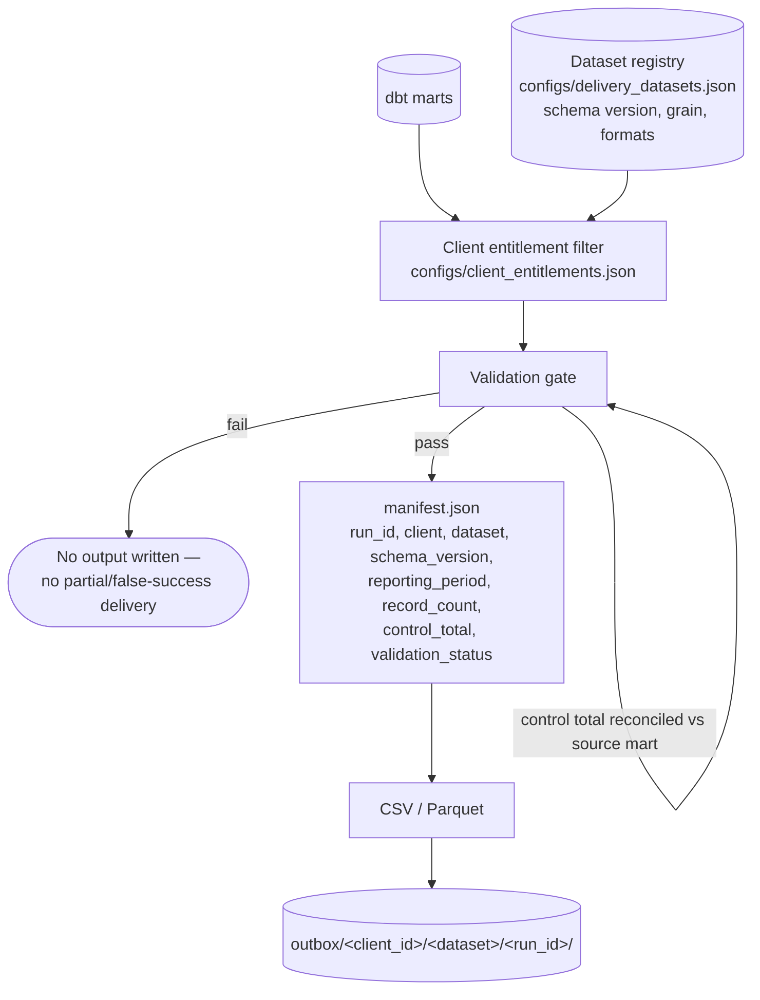

# 7. Client Data Delivery

Reads dbt marts only — never Bronze, Silver, or Gold directly. Every delivery is staged
and validated **before** anything is written; a failed validation leaves nothing behind
in `outbox/`, never a partial or falsely-successful file. Re-running the same
`(client, dataset, reporting_period, schema_version)` combination is recognized and
safely skipped, not silently overwritten, unless a rerun is explicitly forced.

Implemented datasets: `transaction_mart` (CSV + Parquet) · `settlement_mart` (CSV) ·
`reconciliation_mart` (CSV) · `merchant_mart` (Parquet) · `client_program_mart`
(Parquet, row-filtered per client).

**This is the actual external-delivery mechanism — Power BI is a separate, internal-only
consumer of the same marts (see [`08-power-bi-consumption.md`](08-power-bi-consumption.md)),
not the delivery path.** The current delivery destination is a local `outbox/` directory
only; no SFTP, email, REST API, S3, or Azure Blob transport exists today.

Orchestrated by Airflow's `merchantmcc_client_delivery` DAG (`0 6 * * *`).
