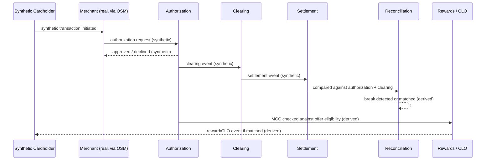

# 7. Fintech Transaction Lifecycle (Synthetic)

Status: PLANNED — no transaction generator exists yet. This diagram documents the intended
synthetic event model. **All data in this flow is synthetic** — no real cardholder, PAN, or
transaction data is involved at any stage.

The transaction touches one real anchor point — the merchant, via its real OSM identity and
real MCC classification — everything else in this sequence is synthetic or derived from
synthetic data.
