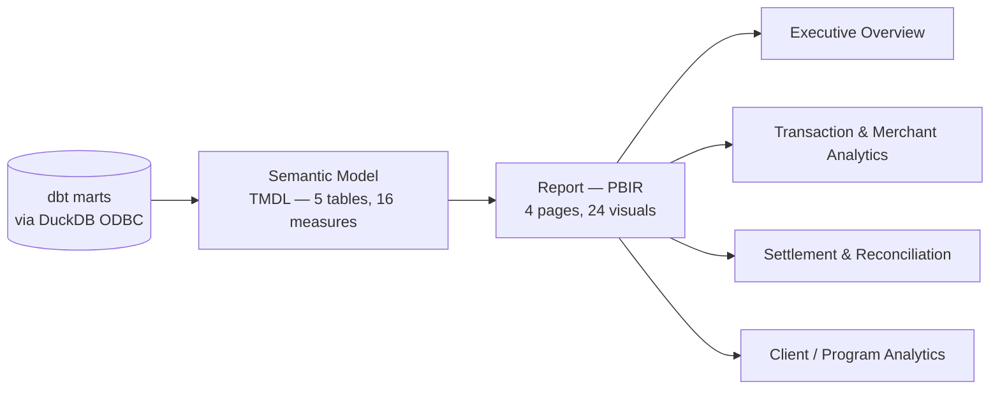

# 8. Power BI Consumption

A Power BI Project (PBIP) authored directly as text (TMDL semantic model + PBIR report
definition) at
[`reports/MerchantMCC_S15C_Executive_Overview.pbip`](../../reports/MerchantMCC_S15C_Executive_Overview.pbip),
connected to the same dbt marts as Client Delivery via a DuckDB ODBC data source — 5
marts, 16 DAX measures, 4 pages, 24 visuals, and 46 field references, each verified
against the semantic model's real columns/measures.

**Power BI is internal analytics only — it is not the client delivery mechanism.** See
[`07-client-data-delivery.md`](07-client-data-delivery.md) for the actual governed,
file-based external-delivery path.

PBIP/PBIR structure and semantic references have been schema-validated, and the ODBC data
connection has been independently validated. Final Power BI Desktop rendering
verification is a manual step, tracked in the project's own status documentation rather
than assumed.
