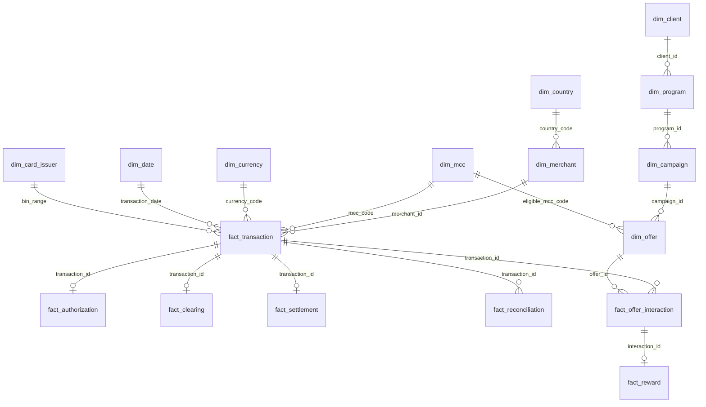

# 8. Conceptual Warehouse / Star Schema

Status: PROPOSED — no warehouse tables exist yet. Full field-by-field source classification
(real/reference/synthetic/derived) is in [`docs/11-data-model.md`](../../docs/11-data-model.md).

