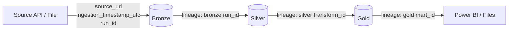

# 9. Data Lineage

Status: PLANNED — OpenLineage/Marquez integration, deferred until Silver/Gold
transformations exist. This diagram shows the lineage metadata foundation already designed
into every Bronze write.

Full narrative: [`docs/15-data-lineage.md`](../../docs/15-data-lineage.md).
