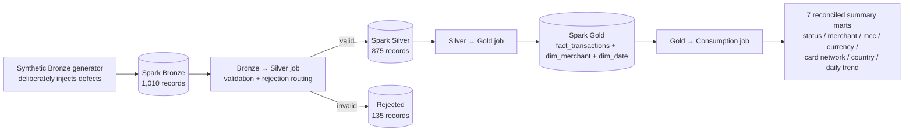

# 9. Spark Pipeline (Independent Engineering Track)

A separate, self-contained PySpark pipeline (`src/spark/`) demonstrating the same
medallion pattern with a distributed-processing engine. **This track is intentionally
independent of the production Gold pipeline** — it shares no code or data with the
API/CDC path in §1–§7 — and exists to demonstrate Spark-specific engineering patterns
(partitioning, window functions, ANSI-mode type coercion, three-valued-logic null
handling) rather than to reprocess production volumes that don't require a distributed
engine at this scale.

The synthetic Bronze generator deliberately injects realistic defects — missing IDs,
malformed timestamps, invalid statuses, duplicate transaction IDs, inconsistent casing —
so the Bronze→Silver job's validation and rejection routing has real, non-trivial work to
do: of 1,010 generated records, **875 pass validation into Spark Silver and 135 are
routed to rejection**, with every rejection carrying a recorded reason. All seven
Consumption-layer marts independently reconcile back to `fact_transactions`.
