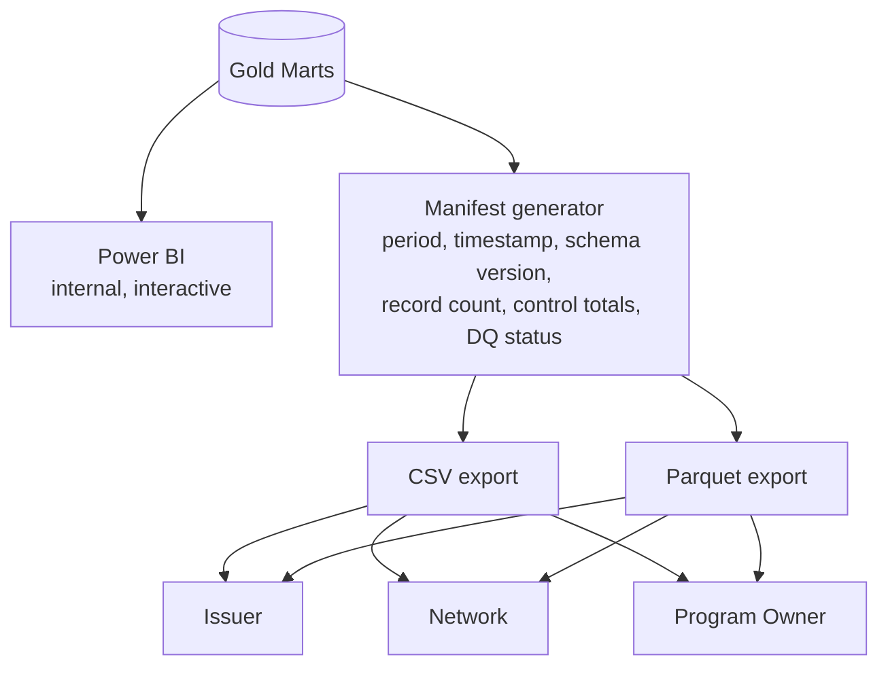

# 10. Final Data Delivery Architecture

Status: PLANNED.

A dashboard is for a human exploring data interactively; a governed file is what a
downstream system actually loads and validates against a control total. Full narrative:
[`docs/16-data-delivery.md`](../../docs/16-data-delivery.md).
