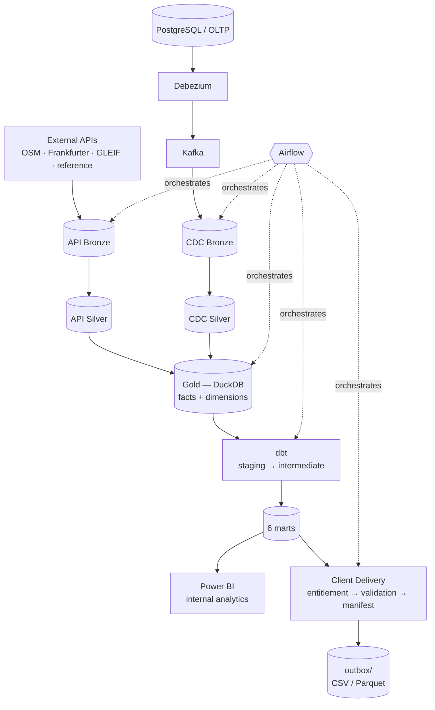

# 10. End-to-End Data Flow

The complete path from source to consumption, combining every stage documented
individually in this folder.



**Every stage in this diagram is real and independently verified** — not a plan. The
reconciled identity that proves the pipeline is internally consistent end to end:

```
Approved transaction amount  =  Settlement amount  =  Reconciliation expected amount  =  £435,106.16
```

recomputed independently at Gold, at the dbt mart layer, and again inside Client
Delivery's own validation gate — all three agree. The gross total across all transaction
statuses (£501,672.07) is a different, non-control figure — see
[`04-gold-warehouse.md`](04-gold-warehouse.md).

A separate, independent PySpark track (§9) and the Power BI semantic model (§8) both sit
alongside this flow without altering it — Spark shares no code or data with it, and Power
BI is one of two read-only consumers of the marts, not a stage in producing them.
