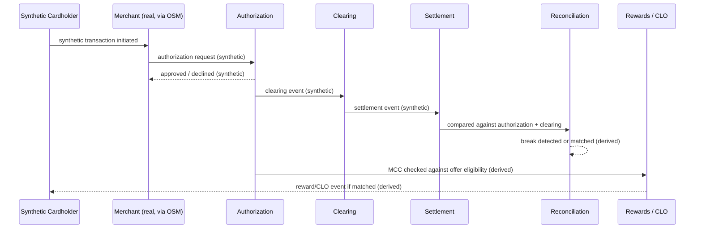

# 13. Fintech Transaction Lifecycle (Synthetic)

Status: Implemented — the synthetic transaction/event generator and this full lifecycle
are real and running (4,000 transactions in the current Gold dataset). **All data in this
flow is synthetic** — no real cardholder, PAN, or transaction data is involved at any
stage.

The transaction touches one real anchor point — the merchant, via its real OSM identity and
real MCC classification — everything else in this sequence is synthetic or derived from
synthetic data.
