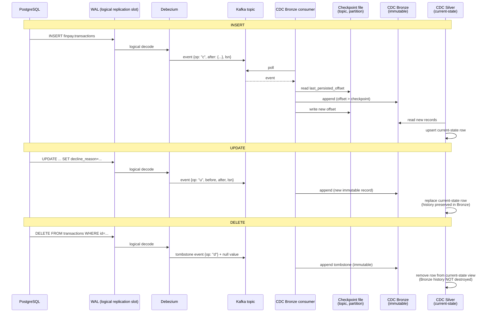

# 15. CDC Event Lifecycle (INSERT / UPDATE / DELETE)

How a single row-level change in PostgreSQL becomes a durable, idempotent fact in Gold —
the mechanism CDC exists to provide, shown for all three operation types.

**Idempotency, concretely**: the checkpoint file tracks `last_persisted_offset` per
`(topic, partition)`, independent of Kafka's own consumer-group offset. If the same
message is delivered twice (a real, expected Kafka possibility), the consumer compares
its offset against the checkpoint and skips anything already persisted — reprocessing
produces zero duplicate Bronze records.

**Full history vs. current state, concretely**: CDC Bronze is append-only and never
rewritten — every insert, update, and delete for a row remains queryable forever. CDC
Silver derives a current-state view from that same history, so a delete correctly removes
a row from Silver's live view without erasing the fact that it ever existed in Bronze.

Full detail: [`docs/25-cdc-bronze-design.md`](../../docs/25-cdc-bronze-design.md),
[`docs/26-cdc-silver-design.md`](../../docs/26-cdc-silver-design.md).
