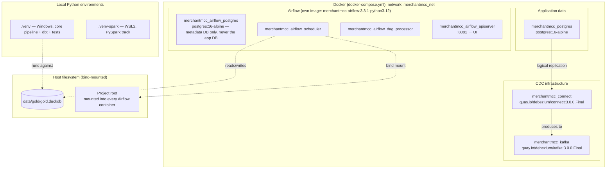

# 16. Deployment / Local Infrastructure

Everything runs locally via Docker Compose — no cloud infrastructure. Real container
names, confirmed running:

Seven containers, one Docker network (`merchantmcc_net`), two distinct PostgreSQL
instances (application data vs. Airflow's own metadata store — deliberately never the
same instance). No managed cloud service, no Kubernetes — a single-broker Kafka and a
single Debezium connector, appropriate for a local portfolio demonstration, not a
production-scale deployment claim.

`data/gold/gold.duckdb` is a single file on the host filesystem, bind-mounted into the
Airflow containers and opened directly by the local Python environment and (via ODBC) by
Power BI Desktop — there is no separate database server process for the warehouse layer.
