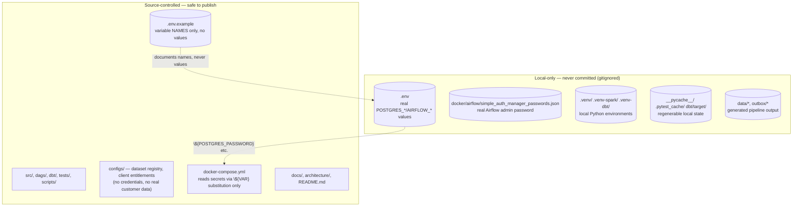

# 17. Security Boundary

What is a secret, what isn't, and where the line is enforced.

**Enforced how**: `.gitignore` excludes `.env`, the Airflow password file, all virtual
environments, and every generated data directory by name. `docker-compose.yml` never
contains a literal credential — every password/secret field is a `${VAR}` substitution
resolved from `.env` at container-start time. No API used by this project (OpenStreetMap
Overpass, Frankfurter, GLEIF) requires a key at all, so there is no API credential to
manage in the first place. A dedicated repository and git-history audit confirmed no
secret has ever been committed.
