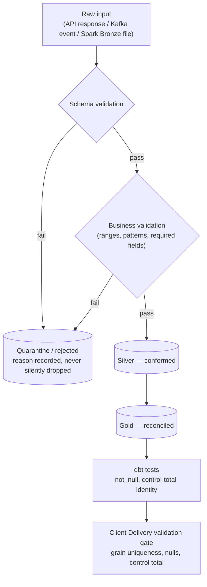

# 18. Data Quality Flow (Consolidated)

Every layer applies the same discipline — validate before trusting, quarantine rather
than silently drop or repair, reconcile totals independently rather than trust a prior
layer. Shown once here across all four pipelines, with real, current numbers.



**Real, current examples — not illustrative:**

| Pipeline | Input | Valid | Rejected |
|---|---|---|---|
| Spark Bronze → Silver | 1,010 synthetic records (defects deliberately injected) | 875 | 135 |
| API Silver (iso_currency, historical) | — | — | 28 real quarantine runs on disk, each with a recorded reason |

**Reconciliation, independently re-proven at three separate layers:**

```
Approved transaction amount (Gold, Python)        = £435,106.16
Settlement amount (Gold, Python)                   = £435,106.16
Reconciliation expected amount (Gold, Python)      = £435,106.16
              ↓ re-verified independently ↓
dbt singular test (assert_control_total_identity)  = PASS (73/73 dbt tests)
              ↓ re-verified independently ↓
Client Delivery's own validation gate (per dataset) = control_total reconciled vs. source mart
```

A genuine, retained discrepancy is also visible, not hidden: reconciliation's
`actual_amount_total` (£434,846.91) differs from `expected_amount_total` (£435,106.16) by
−£259.25 — a real variance the platform surfaces rather than reconciles away.
