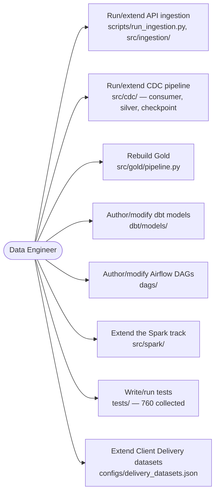
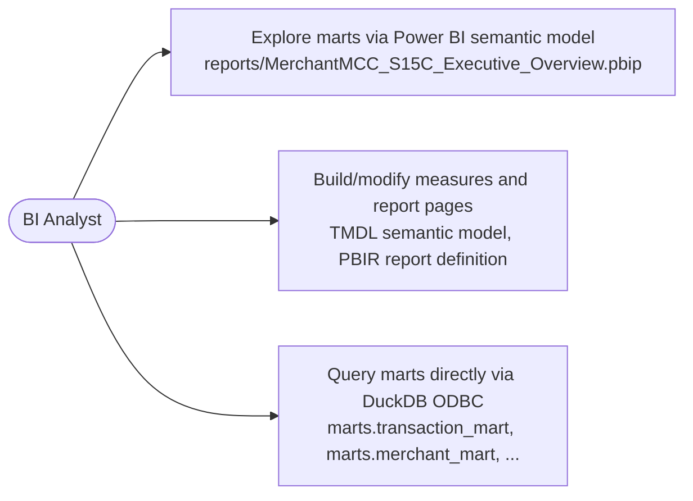
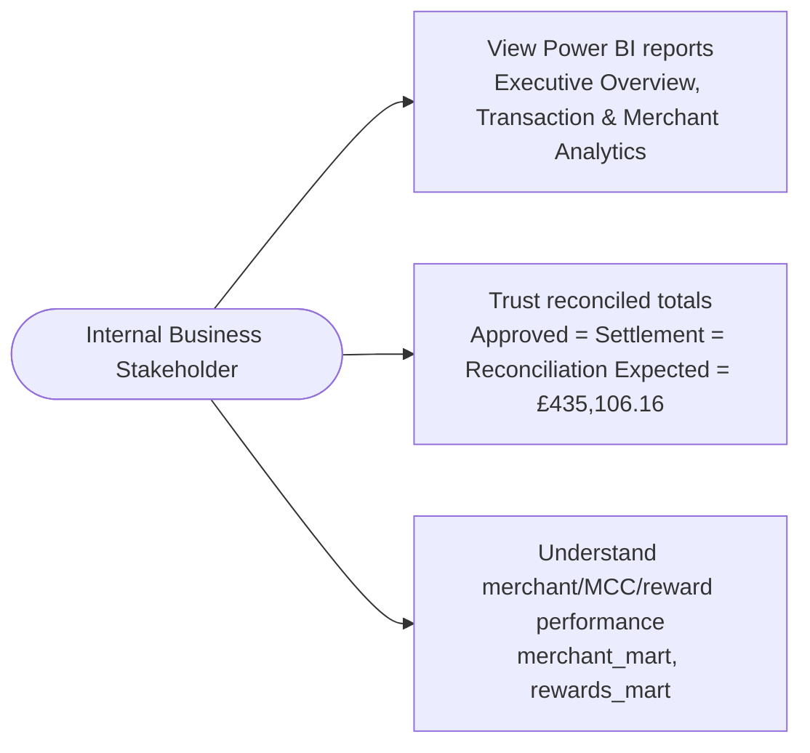
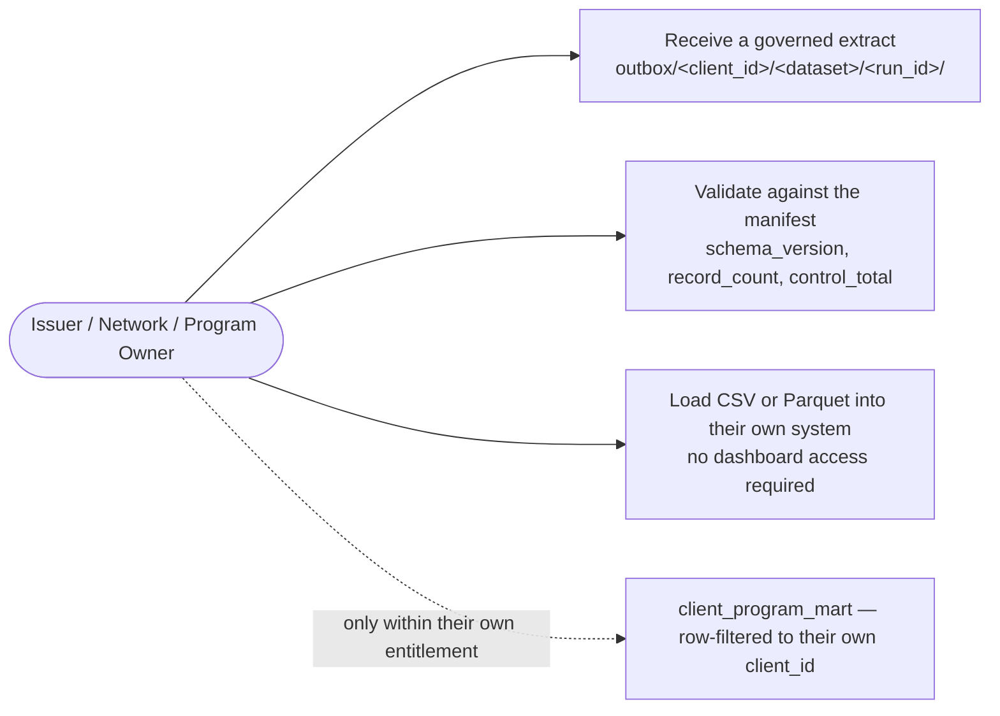
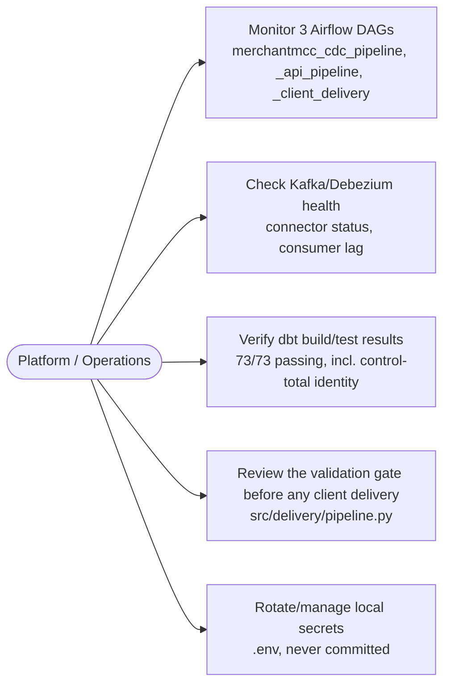

# Use Cases

Who interacts with MerchantMCC-DE, and through which real, implemented capability — not
hypothetical functionality. Mermaid doesn't have native UML use-case notation, so each
diagram below is a `flowchart` connecting an actor to the specific capabilities they
actually use.

## 1. Data Engineer

## 2. BI Analyst

## 3. Internal Business Stakeholder

## 4. Issuer / Network / Program Owner (external client)

## 5. Platform / Operations

Every capability referenced above maps to real, implemented code — see
[`../../docs/EVIDENCE.md`](../../docs/EVIDENCE.md) for the full capability → code →
test → evidence mapping.
