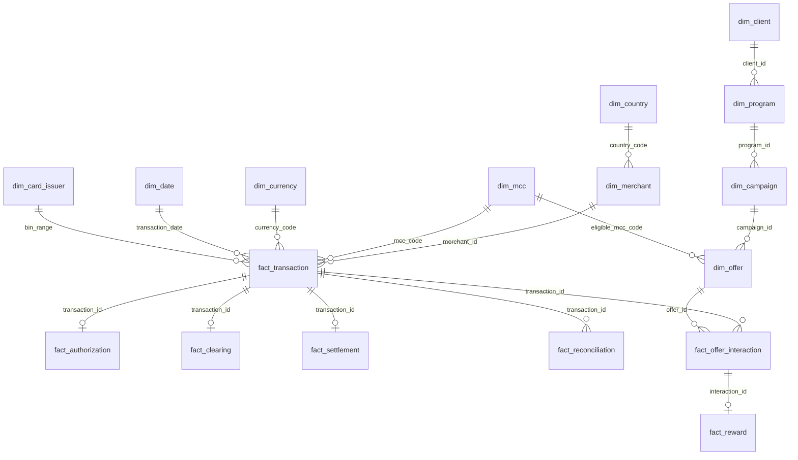

# 11 — Data Model

Status: **PROPOSED** conceptual model — no warehouse tables exist yet.

## Dimensions

| Table | Source |
|---|---|
| `dim_date` | DERIVED (standard calendar dimension) |
| `dim_merchant` | REAL (OSM) + DERIVED (`mcc_code` via crosswalk, `merchant_id` surrogate) |
| `dim_mcc` | REAL (MCC reference) |
| `dim_country` | REAL (country reference) |
| `dim_currency` | REAL (ISO 4217, deduplicated) |
| `dim_client` | REAL (GLEIF legal entities) |
| `dim_program` | SYNTHETIC |
| `dim_campaign` | SYNTHETIC |
| `dim_offer` | SYNTHETIC, except its `eligible_mcc_code` FK value, which is REAL |
| `dim_card_issuer` | REAL (BIN/IIN reference) |

## Facts

| Table | Source |
|---|---|
| `fact_transaction` | SYNTHETIC; `mcc_code` is DERIVED (copied from the merchant at transaction time) |
| `fact_authorization` | SYNTHETIC |
| `fact_clearing` | SYNTHETIC |
| `fact_settlement` | SYNTHETIC |
| `fact_reconciliation` | DERIVED (computed by comparing the three lifecycle facts) |
| `fact_reward` | DERIVED (computed by matching transaction MCC to offer eligibility) |
| `fact_offer_interaction` | DERIVED (records each transaction-to-offer match evaluation, whether or not it resulted in a reward) |

## Star schema (conceptual)

The merchant side (`dim_merchant`/`dim_mcc`/`dim_country`/`dim_currency`) and the
institutional/program side (`dim_client`/`dim_program`/`dim_campaign`/`dim_offer`) are
independent branches that converge only at `fact_transaction` — not a single chained
sequence. `dim_card_issuer` (BIN/IIN) is independent again, relating to the payment
instrument rather than either the merchant or the program.

## OSM → MCC crosswalk

OpenStreetMap has no concept of MCC. Mapping `shop=`/`amenity=` tags to MCC codes is a
**controlled, versioned, confidence-scored reference table**
(`ref_osm_category_to_mcc(osm_key, osm_value, mcc_code, confidence, assumption_notes)`),
never an automated algorithm presented as reliable. Low-confidence and fallback mappings
are queryable as a manual-review backlog rather than silently assumed correct.

## Planned Silver-layer cross-source checks

1. Every FX `currency_code` must exist in `dim_currency`.
2. Every OSM→MCC crosswalk output must reference a valid `dim_mcc.mcc_code`.
3. Every `dim_card_issuer` reference used by a synthetic cardholder must exist in the
   ingested BIN/IIN data.
