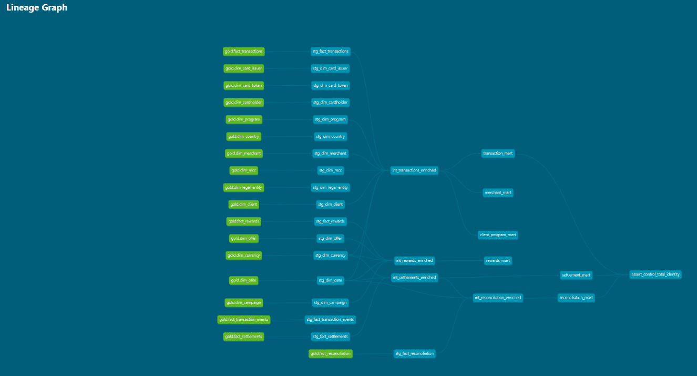
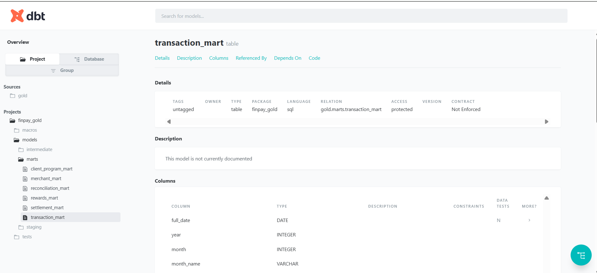

# dbt / Gold Evidence

Real screenshots from a generated `dbt docs` site, plus the real `dbt build` CLI output,
all captured 2026-09-28.

### dbt lineage graph



The full model DAG: 18 Gold source relations (`gold.fact_*` / `gold.dim_*`, green) feed
18 staging models (blue, `stg_*`), which feed 4 intermediate enrichment models
(`int_transactions_enriched`, `int_rewards_enriched`, `int_settlements_enriched`,
`int_reconciliation_enriched`), which feed the 6 marts, which feed
`assert_control_total_identity` — the singular test node on the far right that
independently re-verifies the £435,106.16 control total from the marts themselves.

### Model detail — `transaction_mart`



The generated documentation site's detail page for `marts.transaction_mart`: real
relation name (`gold.marts.transaction_mart`), package (`finpay_gold`), materialization
(`table`), and column list with real types, exactly matching the model's actual compiled
SQL.

## Real CLI evidence

[`dbt_build_output.txt`](dbt_build_output.txt) — the actual output of `dbt build`, run
live against this project's real `dbt/` project and `data/gold/gold.duckdb`. Final line:

```
Done. PASS=73 WARN=0 ERROR=0 SKIP=0 NO-OP=0 REUSED=0 TOTAL=73
```

73/73: 6 mart table models + 22 staging/intermediate view models + 45 data tests,
including `assert_control_total_identity`.

No credentials appear anywhere in dbt's output or the docs site — `dbt/profiles.yml` is a
local, file-based DuckDB profile with no connection secrets.
